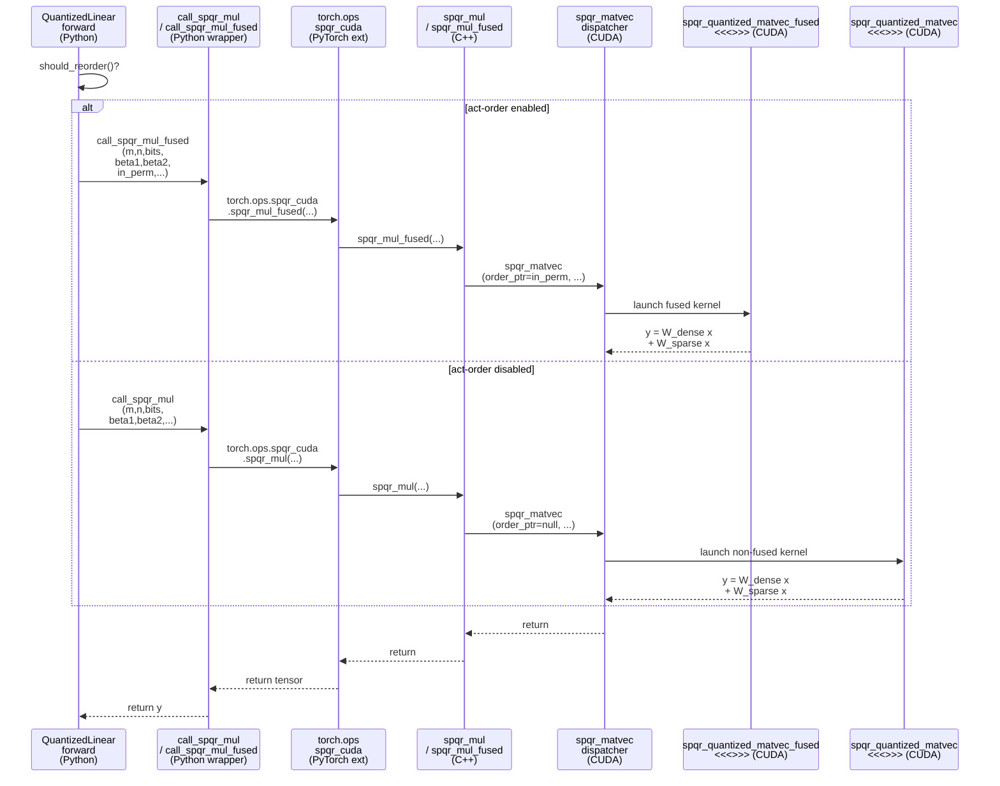

# Explaining `spqr_cuda_kernel.cu`

This note explains the main CUDA logic in  
`context/refcode/SpQR/inference_lib/src/spqr_quant/inference_kernels/spqr_cuda_kernel.cu`.
The file implements SpQR’s **quantized dense matvec** plus **fp16 sparse‑outlier matvec**
in a single fused kernel.

## 1. What the kernel computes

SpQR stores each linear layer as

\[
W \approx W_{\text{dense}} + W_{\text{sparse}},
\]

where:
- \(W_{\text{dense}}\): low‑bit (3‑bit) quantized base weights with bilevel stats.
- \(W_{\text{sparse}}\): a small fp16 residual of outlier weights in CSR‑like format.

Given an activation vector \(x\in\mathbb{R}^{n}\), inference needs

\[
y = W_{\text{dense}}x + W_{\text{sparse}}x .
\]

Both terms are computed inside the same CUDA kernel to avoid launching a separate
sparse matvec.

### Relation to paper “Inference with SpQR”

The paper’s inference section describes two fused pieces:

1. **Dense path**: load a quantization group (weights + stats) into shared memory, dequantize to fp16, then multiply by fp16 activations.  
   - In the kernel this is the **tile loop**: each thread loads a packed `uint64_t` row word, reconstructs second‑order stats (`SecondOrder`), dequantizes first‑order `(s,z)` and the 16 weights, and accumulates `dot(w, x)` using `s_x2` in shared memory.

2. **Sparse outlier path**: exploit row‑contiguous outliers; each block works on a row segment, loads CSR metadata, and adds `v * x[c]` for outliers.  
   - In the kernel this is the **CSR add**: `row_offsets` for the block’s rows are prefetched into shared memory, and each output row walks its contiguous `col_vals` range, adding fp16 residuals. Work is split across subtiles for load balancing, matching the paper’s “load slice → distribute work” idea.

Because autoregressive decoding is memory‑bound, the kernel’s reduced memory traffic from 3‑bit tiles outweighs the extra decode/sparse overhead, giving the speedups reported in the paper.

### Paper inference steps → kernel implementation

**Kernel inputs (LLM / transformer context)**:

Each call to `spqr_matvec` corresponds to **one linear layer matvec** in the LLM (token‑by‑token decode).  
In a transformer block this is the weight matrix of a projection such as:
- Attention: `q_proj`, `k_proj`, `v_proj`, `o_proj`
- MLP: `gate_proj`/`up_proj`, `down_proj`

For the current token (batch=1), the kernel computes \(y = Wx\) with SpQR‑encoded \(W\):

- `prob_m`, `prob_n`: output/input dimensions of this linear layer \(W\in\mathbb{R}^{m\times n}\).
- `dense_matrix`: packed 3‑bit tiles for \(W_{\text{dense}}\).
- `row_offsets`, `col_vals`, `nnz`: CSR‑like arrays for fp16 outliers \(W_{\text{sparse}}\).
- `in_order` (optional): GPTQ activation‑order permutation of the `n` input features.
- `x`: fp16 activation vector for the current token entering this layer (\(\mathbb{R}^{n}\)).
- `y_fp16` / `out`: fp16 output vector (\(\mathbb{R}^{m}\)), fed into the next sublayer.

The paper then summarizes GPU decoding as steps (1)–(4). Here is how they show up in `spqr_cuda_kernel.cu`:

1. **Divide the matrix into equally sized blocks.**  
   - The dense matrix is partitioned into **16×16 SpQR tiles** (`BETA1=BETA2=16`).  
   - CUDA grid `blockIdx.x` iterates over *tile rows* (output segments). Each block processes `BLOCK_HEIGHT` tile rows and sweeps over tile columns in chunks of `BLOCK_WIDTH`.  
   - Concretely, `tile_row_id = blockIdx.x * BLOCK_HEIGHT + threadIdx.y` selects the output block this CUDA block owns.
   
   Code (tile/block mapping in `context/refcode/SpQR/inference_lib/src/spqr_quant/inference_kernels/spqr_cuda_kernel.cu:249`):
   ```cpp
   const u32 tile_row_id = blockIdx.x * BLOCK_HEIGHT + threadIdx.y;
   u32 row_pos = thread_xy & 0xF;           // row within 16‑row tile
   const u32 subtile_id = threadIdx.x / BETA1; // tile column within block
   auto raw_data_offset = tile_row_id * prob_n + threadIdx.x;
   ```

2. **Load a slice of outliers into shared memory.**  
   - Outliers are stored CSR‑like and sorted by row. A full outlier slice may be too large to stage, so the kernel stages **only the CSR row offsets** for this output block in shared memory:  
     `__pipeline_memcpy_async(s_row_offsets + i, row_offsets + blockIdx.x * ROW_OFFSETS_SIZE + i, ...)` then `__pipeline_commit()` and `__syncthreads()`.  
   - This matches the paper’s “load outlier metadata into SRAM” to enable fast per‑row access.
   
   Code (CSR row‑offset prefetch in `spqr_cuda_kernel.cu:276`):
   ```cpp
   for (u32 i = thread_xy; i <= ROW_OFFSETS_SIZE; i += THREAD_COUNT) {
     __pipeline_memcpy_async(
         s_row_offsets + i,
         row_offsets + blockIdx.x * ROW_OFFSETS_SIZE + i,
         sizeof(u32));
   }
   __pipeline_commit();
   __syncthreads();
   ```

3. **Determine which outliers belong to the segment.**  
   - With CSR, this is essentially free: each output row in the block reads its contiguous range  
     `s = s_row_offsets[t]; e = s_row_offsets[t+1];`  
     where `t = threadIdx.y * BETA1 + row_pos`.  
   - Because outliers are row‑sorted, the `[s,e)` slice already corresponds to “outliers in this segment”.
   
   Code (select per‑row CSR slice in `spqr_cuda_kernel.cu:361`):
   ```cpp
   u32 t = threadIdx.y * BETA1 + row_pos;
   u32 s = s_row_offsets[t];
   u32 e = s_row_offsets[t + 1];
   ```

4. **Load corresponding weights from main memory and multiply.**  
   - **Dense weights**: each thread loads its packed 64‑bit row word for the current tile column via `__ldg(local_raw_data)`, reconstructs bilevel stats, dequantizes 16 weights, and performs the dot‑product with activations in shared memory.  
   - **Sparse outliers**: threads iterate `k ∈ [s,e)` and load `ColVal` entries from global memory (`__ldg(col_vals + k)`), then accumulate `v * x[c]`. The accesses are mostly contiguous because of the row‑wise CSR ordering, matching the paper’s locality argument.
   
   Code (dense decode + dot in `spqr_cuda_kernel.cu:302`):
   ```cpp
   auto v = __ldg(local_raw_data);
   row_bits.mask = v;
   SecondOrder _s{.v = recover_second_order_sync(
       (row_bits.mask >> NUM_USEFUL_BITS)
       << (SECOND_ORDER_FRAGMENT_SIZE_BITS * (row_pos / OFFSET)))};
   half2 sz = dequantize2(INT2_TO_HALF2(row_bits.get_w2(0)),
                          _s.get_sws2(), _s.get_swz2());
   half2 ws2 = __half2half2(sz.x), wz2 = __half2half2(sz.y);
   #pragma unroll
   for (u32 j = 0; j < BETA2 / 2; j++) {
     half2 w = dequantize2(INT2_TO_HALF2(row_bits.get_w2(j + 1)), ws2, wz2);
     acc = fmaf(__half2float(w.x), __half2float(s_x2_[j].x), acc);
     acc = fmaf(__half2float(w.y), __half2float(s_x2_[j].y), acc);
   }
   ```
   Code (sparse outlier add in `spqr_cuda_kernel.cu:366`):
   ```cpp
   for (u32 i = s + subtile_id; i < e; i += BLOCK_WIDTH) {
     ColVal colval{._ = __ldg(col_vals + i)};
     acc += __half2float(colval.members.v) * __half2float(s_x[colval.members.c]);
   }
   ```

Overall, the kernel fuses the dense and sparse multiplications per block, aligning closely with the high‑level decoding strategy described in the paper’s “Inference with SpQR” section.

## 2. Data layout

### 2.1 Tile sizes

`spqr_matvec` instantiates kernels as `F<3,16,16,...>`, so this kernel assumes:

- `BITS = 3` (base weight bits)
- `BETA1 = 16`  → **tile height** (#output rows per tile)
- `BETA2 = 16`  → **tile width**  (#input columns per tile)

So the dense matrix is treated as a grid of **16×16 tiles**.

### 2.2 Dense tile storage (`dense_matrix`)

`dense_matrix` is a `uint64_t*`. For each tile column (width `BETA2`), there is
**one 64‑bit word per output row** in that tile. Logical layout:

```
dense_matrix[tile_row_id][tile_col_id][row_in_tile]
```

Each 64‑bit word packs:

- **First‑order stats and weights (low 54 bits)**  
  - `s` (3 bits): quantized scale for this row & tile column group.  
  - `z` (3 bits): quantized zero‑point.  
  - `w_0..w_15` (16×3 = 48 bits): 16 quantized weights for this row over the tile’s columns.  

  Total: `(2 + 16) * 3 = 54` bits = `NUM_USEFUL_BITS`.

- **Second‑order fragment (high bits)**  
  Each row carries an 8‑bit “fragment” of the bilevel stats. Across the 16 rows of
the tile these fragments are combined into a full 64‑bit `SecondOrder` value.

Helpers:

- `RowBits` (kernel) overlays a `uint64_t mask` and provides:
  - `get_w2(i)`: extract a 6‑bit chunk = two 3‑bit values.
    - `i=0` → `(s,z)` pair.
    - `i=1..8` → two weights each.
- Per‑warp LUT (`s_half2_lut`) maps a 6‑bit integer to `half2(q0,q1)` without shifts.
- `SecondOrder` (from `common.cuh`) is:
  ```cpp
  union SecondOrder {
    uint64_t v;
    struct { half2 ss; half2 zz; } members;
  };
  ```
  It stores the **second‑order scales** for dequantizing first‑order `(s,z)`.

### 2.3 Sparse outliers (`row_offsets`, `col_vals`)

Outliers are CSR‑like:

- `row_offsets` (`int32`, length `m+1`): for output row `r`,
  outliers live in `col_vals[row_offsets[r] : row_offsets[r+1]]`.
- `col_vals` (`uint32`): each entry packs
  - `c` (`int16`): column index.
  - `v` (`half`): fp16 outlier value.

This is represented by `ColVal` in `common.cuh`.

### 2.4 Optional activation permutation (`in_order`)

If GPTQ “act‑order” is enabled, `in_order` (`uint16`) is a permutation of input
features.  

- `spqr_quantized_matvec_fused` uses `in_order` to permute `x` **as it loads into shared memory**.
- `spqr_quantized_matvec` assumes no permutation (or `x` already permuted).

## 3. Kernel logic

There are two nearly identical kernels:

- `spqr_quantized_matvec_fused(...)` — dense + sparse, with activation permutation.
- `spqr_quantized_matvec(...)` — dense + sparse, without permutation.

Below describes the fused kernel; the non‑fused version just skips the permute.

### 3.1 Thread/block mapping

Grid/block:

- `blockIdx.x` enumerates tile rows (output direction).  
- `BLOCK_HEIGHT` is usually 1, so each block handles one tile row.
- `blockDim.x = BLOCK_WIDTH * BETA1` threads (multiple tile columns at once).
- `blockDim.y = BLOCK_HEIGHT`.

Thread roles:

- `tile_row_id = blockIdx.x * BLOCK_HEIGHT + threadIdx.y` selects the tile row group.
- `row_pos = threadIdx.x % BETA1` selects output row within the 16‑row tile.
- `subtile_id = threadIdx.x / BETA1` selects which tile column this thread is working on.

So **each tile column is handled by 16 threads**, one per output row.

### 3.2 Shared memory

Per block:

- `s_x2` (dynamic shared, `half2[]`): the activation vector `x` in permuted order.
- `s_half2_lut_global`: per‑warp 64‑entry LUT for 3‑bit decoding.
- `s_row_offsets`: CSR offsets for all output rows in this tile row.

### 3.3 Load activations (with permutation)

Threads cooperatively fill `s_x2`:

```cpp
idx = pipeline_id * THREAD_COUNT + thread_xy;   // half2 index
if (idx < prob_n/2) {
  ushort2 ord = in_order_u32[idx];             // two permuted indices
  s_x2[idx] = make_half2(x[ord.x], x[ord.y]);
}
```

After this, all tile columns reuse `s_x2` without more global reads.

### 3.4 Dense matvec over quantized tiles

For each tile column `i` assigned to this subtile:

1. **Load packed row word**
   ```cpp
   uint64_t v = __ldg(local_raw_data);
   RowBits row_bits{.mask = v};
   ```

2. **Reconstruct second‑order stats**
   - Extract this row’s 8‑bit fragment from the high bits:
     ```cpp
     s_order_partial =
       (row_bits.mask >> NUM_USEFUL_BITS)
       << (8 * (row_pos / OFFSET));
     ```
   - `recover_second_order_sync` OR‑reduces fragments across the half‑warp using
     shuffle‑xor so every lane gets the full 64‑bit `SecondOrder`.

3. **Dequantize first‑order `(s,z)`**
   ```cpp
   half2 q_sz = LUT[row_bits.get_w2(0)];                  // 3‑bit s,z
   half2 sz = dequantize2(q_sz, _s.get_sws2(), _s.get_swz2());
   ws2 = sz.x;  // scale
   wz2 = sz.y;  // zero
   ```

4. **Dequantize weights and accumulate**
   Each 6‑bit chunk stores two weights:
   ```cpp
   for j in 0..7:
     half2 q_w = LUT[row_bits.get_w2(j+1)];
     half2 w = dequantize2(q_w, ws2, wz2);
     acc += dot(w, s_x2_[j]);
   ```
   `s_x2_ = s_x2 + i*(BETA2/2)` points at the 8 `half2` activations for this tile column.

Threads then advance to the next tile column:
`i += BLOCK_WIDTH`, `local_raw_data += BLOCK_WIDTH * BETA1`.

### 3.5 Add fp16 sparse outliers

After dense accumulation, each output row adds its CSR outliers:

```cpp
t = threadIdx.y * BETA1 + row_pos;
s = s_row_offsets[t];
e = s_row_offsets[t + 1];

for (k = s + subtile_id; k < e; k += BLOCK_WIDTH) {
  ColVal cv{._ = __ldg(col_vals + k)};
  acc += float(cv.v) * float(s_x[cv.c]);
}
```

The outlier work for a row is split across subtiles via `subtile_id`.

### 3.6 Reduce across subtiles and write output

If `BLOCK_WIDTH>1`, each row has partial sums from multiple subtiles.

1. **Half‑warp shuffle combine** (merges paired subtiles).
2. **Shared reduction** for remaining warps (partial sums are staged in shared memory).
3. **Writeback** by the first subtile:
   ```cpp
   if (threadIdx.x < BETA1)
     y_fp16[tile_row_id * BETA1 + threadIdx.x] = __float2half(acc);
   ```

## 4. Host dispatcher `spqr_matvec`

`spqr_matvec(...)` chooses and configures the kernel:

- If `order_ptr == nullptr` → launch `spqr_quantized_matvec` (no permutation).
- Else → launch `spqr_quantized_matvec_fused` (permutes `x` on load).

It selects `BLOCK_WIDTH` based on `prob_n` alignment (512, 256, 128, …),
balancing occupancy vs. per‑block work.

Sparse format:

- `row_offsets_len == prob_m + 1` → normal CSR (`IS_CSR=true`).
- Otherwise use a baseline sparse layout (`IS_CSR=false`).

### Call chain in the reference implementation

At a high level, the fused kernel is reached as:

- `QuantizedLinear.forward` (`context/refcode/SpQR/inference_lib/src/spqr_quant/inference.py:317`)  
  decides whether to use activation‑order (`should_reorder()`).
- If yes: `call_spqr_mul_fused(...)` (`context/refcode/SpQR/inference_lib/src/spqr_quant/inference_kernels/cuda_kernel.py:67`)  
  passes `in_perm` (the act‑order permutation).
- Else: `call_spqr_mul(...)` (`context/refcode/SpQR/inference_lib/src/spqr_quant/inference_kernels/cuda_kernel.py:47`).
- These call `torch.ops.spqr_cuda.spqr_mul_fused / spqr_mul` exposed by  
  `spqr_mul_fused / spqr_mul` in `context/refcode/SpQR/inference_lib/src/spqr_quant/inference_kernels/spqr_cuda.cpp:421` / `:52`.
- Both wrappers invoke `spqr_matvec(...)` in `spqr_cuda_kernel.cu`, which launches  
  `spqr_quantized_matvec_fused` (with `in_order`) or `spqr_quantized_matvec` (without).

**Sequence (caller → kernel)**:



## 5. Why this design is fast

- **Shared‑memory reuse of `x`**: permuted activations are loaded once per block and
  reused by 16 output rows.
- **Bit‑packing + LUT decode**: avoids expensive bit extraction and `int→half` conversions.
- **Second‑order reconstruction via shuffles**: no extra global reads for bilevel stats.
- **Dense+sparse fusion**: outliers are added in‑kernel, avoiding another matvec.
- **Half2 vectorization**: processes two weights/activations per instruction.

If you want more detail on the sparse non‑CSR path or the reduction scheme,
tell me which part to zoom into. 

## 6. CUDA device intrinsics used

The kernels rely on several CUDA device‑level intrinsics / PTX ops:

- **Warp shuffle**
  - `__shfl_xor_sync(mask, val, lane_delta)`: exchanges values across warp lanes; here used to OR‑reduce 8‑bit second‑order fragments into a full `SecondOrder` word.
  - `__shfl_down_sync(mask, val, delta)`: warp reduction; used to combine partial accumulators from paired subtiles.

- **Block synchronization**
  - `__syncthreads()`: barrier to coordinate shared‑memory loads and reductions.

- **Read‑only cached loads**
  - `__ldg(ptr)`: loads through the read‑only data cache (dense tile words and sparse `col_vals`).

- **Asynchronous global→shared copies**
  - `__pipeline_memcpy_async(dst_shared, src_global, bytes)` and `__pipeline_commit()`: CUDA C++ pipeline API that lowers to `cp.async` on Ampere+ GPUs; used for prefetching CSR row offsets.
  - Inline PTX `cp.async.ca.shared.global` (guarded by `PIPELINED_LOAD`) for activation prefetch, plus
    `cp.async.wait_group` / `cp.async.wait_all` to wait for outstanding async stages.
  - `__cvta_generic_to_shared(ptr)`: converts a generic pointer to a shared‑memory address for `cp.async`.

- **Half / half2 math and conversions (from `cuda_fp16.h`)**
  - Vector ops: `__hadd2`, `__hmul2`, `__hsub2`, `__half2half2`, `__half22float2`.
  - Scalar ops: `__hadd`, `__hmul`, `__hsub`, `__half2float`, `__float2half`.
  - Int→half conversions: `__int2half_rd`, `__uint2half_rd` for LUT generation / dequantization.

- **FMA**
  - `fmaf(a,b,c)`: fused multiply‑add on float accumulators during dense dot products.
