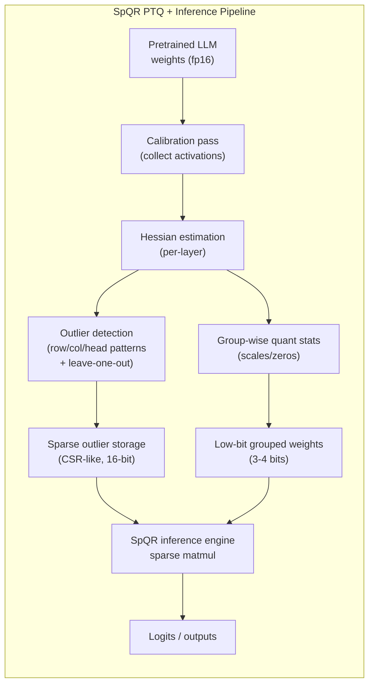
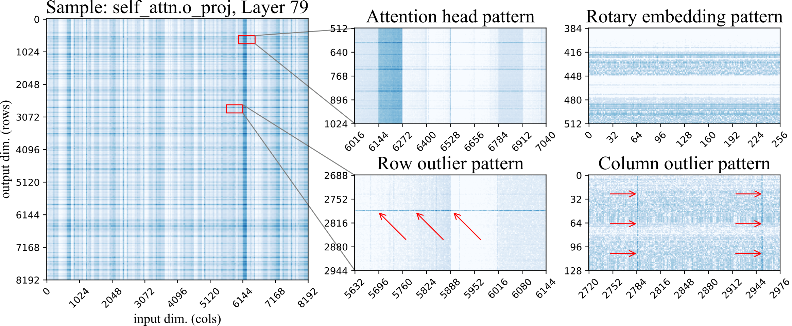
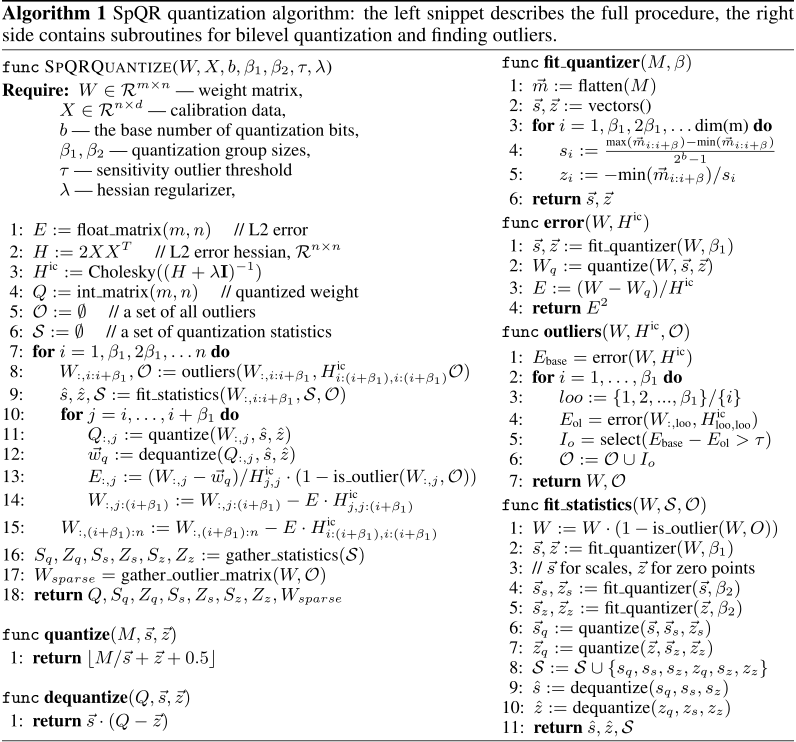
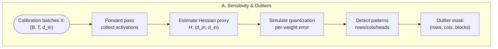
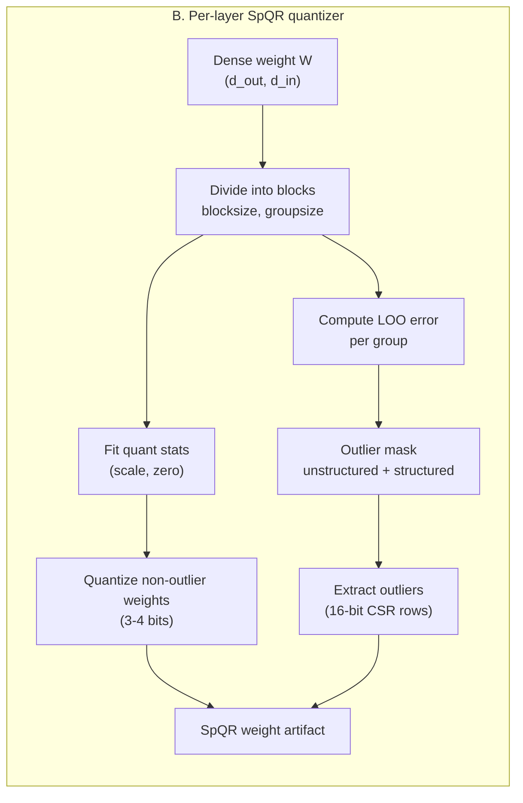
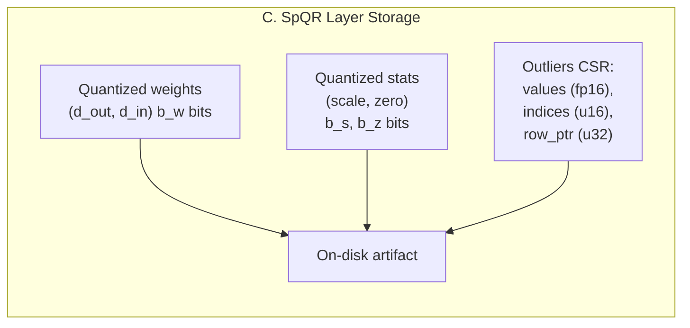

# SpQR: A Sparse-Quantized Representation for Near-Lossless LLM Weight Compression

## 0. Metadata
- **Full Title**: SpQR: A Sparse-Quantized Representation for Near-Lossless LLM Weight Compression  
- **Authors**: Tim Dettmers, Ruslan Svirschevski, Vage Egiazarian, Denis Kuznedelev, Elias Frantar, Saleh Ashkboos, Alexander Borzunov, Torsten Hoefler, Dan Alistarh  
- **Venue / Year**: ICLR 2024 (12th International Conference on Learning Representations)  
- **Links**:  
  - PDF / OpenReview: https://openreview.net/forum?id=Q1u25ahSuy  
  - ArXiv: https://arxiv.org/abs/2306.03078  
  - Code: https://github.com/Vahe1994/SpQR (mirrored locally under `context/refcode/SpQR/`)  
  - Project / ISTA entry: https://research-explorer.ista.ac.at/record/18977  
- **Keywords**: large language models, post-training quantization, sparse representation, outlier weights, GPTQ, low-bit inference  
- **Paper ID (short handle)**: `spqr-llm-quantization`

## 1. TL;DR (3–5 bullets)
- **Problem**: 3-4 bit post-training quantization of LLM weights gives strong memory savings but often causes moderate-to-severe accuracy loss, especially for 1-10B models suited to edge devices.  
  > "However, quantization down to 3-4 bits per parameter usually leads to moderate-to-high accuracy losses, especially for smaller models in the 1-10B parameter range, which are well-suited for edge deployments." (Abstract; paper-source/primary/tex/main.tex)
- **Idea**: Represent the model with a low-bit grouped quantized base plus a tiny fraction of high-precision “outlier” weights stored sparsely, chosen via sensitivity analysis.  
  > "SpQR works by identifying and isolating \emph{outlier weights}, which cause particularly-large quantization errors, and storing them in higher precision, while compressing all other weights to 3-4 bits..." (Abstract; paper-source/primary/tex/main.tex)
- **System**: A GPTQ-style post-training pipeline that detects sensitive weights, encodes most weights with 3-4 bit group-wise quantization, and stores outliers in a CSR-like sparse format with a custom GPU decoder.  
  > "Our quantization algorithm isolates such outliers and efficiently encodes a given model in SpQR format." (Introduction; paper-source/primary/tex/main.tex)  
  > "To exploit the resulting structure, we develop a specialized sparse-matrix multiplication algorithm... [and] combine this sparse algorithm together with a dense-quantized matrix multiplication for 3-4 bit weights." (Introduction; paper-source/primary/tex/main.tex)
- **Efficiency**: Achieves ≈3.4–4.7 average bits/parameter, fits LLaMA/Falcon models up to 65B on a single high-end GPU, and yields 20–30% faster generation than fp16 while staying near-lossless.  
  > "SpQR reduces the memory footprint of LLMs by a factor of about 3.4x or more without degradation in accuracy... while also being 20-30\% faster for LLM generation compared to 16-bit inference." (Introduction; paper-source/primary/tex/main.tex)  
  > "Our implementation takes around 4.5 hours on the largest model size (65B) on an NVIDIA A100..." (Experimental Validation; paper-source/primary/tex/experiments.tex)
- **Result**: First method to reach ≤1% relative perplexity increase vs 16-bit for LLaMA/Falcon 7–65B with <4.75 bits/parameter, while clearly outperforming GPTQ and round-to-nearest (RTN) at matched bit budgets.  
  > "SpQR... enables for the first time \emph{near-lossless} compression of LLMs across model scales, while reaching similar compression levels to previous methods." (Abstract; paper-source/primary/tex/main.tex)  
  > "SpQR with 4.6 to 4.71 bits per parameter approaches the non-quantized models with at most 1\% margin of error for all models..." (Experimental Validation; paper-source/primary/tex/experiments.tex)

## 2. Problem & Motivation

### 2.1 Why low-bit LLM quantization is hard
- **Edge deployment needs extreme compression**: LLMs with tens of billions of parameters do not fit on consumer GPUs or mobile devices at 16 bits, but can fit if compressed to ~3-4 bits/parameter.  
  > "By compressing such LLMs via quantization to 3-4 bits per parameter, they can fit into memory-limited devices such as laptops and mobile phones..." (Abstract; paper-source/primary/tex/main.tex)
- **3-4 bit quantization degrades accuracy**: Existing 3-4 bit post-training quantization (PTQ) methods often incur noticeable perplexity and zero-shot accuracy drops, particularly for smaller models.  
  > "However, quantization down to 3-4 bits per parameter usually leads to moderate-to-high accuracy losses, especially for smaller models in the 1-10B parameter range..." (Abstract; paper-source/primary/tex/main.tex)  
  > "One common drawback of existing methods is that the accuracy loss relative to the original model is still significant... especially... in the 7-13B parameter range, where existing methods show drastic accuracy drops." (Related Work; paper-source/primary/tex/main.tex)
- **Generative setting amplifies small errors**: In autoregressive generation, quantization errors accumulate across tokens and can lead to severely corrupted outputs.  
  > "Since LLM generation is sequential, depending on previously-generated tokens, small relative errors can accumulate and lead to severely corrupted outputs." (Introduction; paper-source/primary/tex/main.tex)
- **Existing PTQ trade-offs**:  
  - **Round-to-nearest (RTN)** and 4-bit quantization are simple but suboptimal in accuracy.  
  - **GPTQ** improves accuracy with a Hessian-aware per-layer solver but still shows several-percent perplexity increase at 3-4 bits.  
  > "ZeroQuant..., LLM.int8()..., and nuQmm... used direct rounding of weights to the nearest quantization level..." (Related Work; paper-source/primary/tex/main.tex)  
  > "GPTQ... proposed a higher-accuracy approach... works via an approximate large-scale solver for the problem of minimizing the layer-wise squared error." (Related Work; paper-source/primary/tex/main.tex)
- **Structured sensitivity in weights**: Quantization error is not uniform across weights; some rows, columns, and heads are much more sensitive and dominate error.  
  > "Using the sensitivity analysis, we observe several patterns in the weight matrix, often in a single row or column." (Exploring parameter sensitivity; paper-source/primary/tex/method.tex)  
  > "We now proceed to categorize outlier structures... \textbf{Row outliers}... \textbf{Column outliers}... \textbf{Sensitive attention heads}... \textbf{The Rotary embedding pattern}... \textbf{Unstructured outliers}." (Exploring parameter sensitivity; paper-source/primary/tex/method.tex)

### 2.2 How SpQR addresses these issues
- **Hybrid representation instead of pure low-bit**: SpQR keeps most weights at 3-4 bits but stores a very small set of high-sensitivity weights in 16-bit form, circumventing the main source of error.  
  > "SpQR works by identifying and isolating \emph{outlier weights}... and storing them in higher precision, while compressing all other weights to 3-4 bits..." (Abstract; paper-source/primary/tex/main.tex)
- **Outlier-aware PTQ pipeline**: Builds on GPTQ’s Hessian-based PTQ to quantify per-weight sensitivity and uses that to select outliers, rather than quantizing everything uniformly.  
  > "Our approach splits this process into two steps: an ``outlier detection'' step... and an actual compression step, in which most ($\geq 99\%$) of weights are compressed to low-bitwidth, the outliers are extracted..." (Introduction; paper-source/primary/tex/main.tex)
- **Grouped quantization with quantized metadata**: Uses very small groups for quantization scales and zeros to reduce error, but stores the scales themselves in low-bit quantized form so that metadata does not dominate the overall bit budget; with 16-bit stats and tiny groups, scale/zero would cost on the order of 2 bits per weight by themselves, making 3-4 bit total budgets impossible.  
   > "We implement a variant of grouped quantization with very small group size, e.g. 16 contiguous elements, but we show that one can quantize the quantization scales themselves to a 3-bit representation." (Introduction; paper-source/primary/tex/main.tex)  
   > "\[\overline{b} \simeq b_{w} + \frac{b_{s} + b_{z}}{\beta_1} + \frac{64}{\beta_1 \beta_2} + 32 r_o\]" (Appendix; paper-source/primary/tex/appendix.tex)
- **CSR-like sparse storage for outliers**: Outliers are stored row-wise like CSR, enabling efficient sparse matmul and predictable memory access patterns.  
  > "To accommodate all possible structures, we encode outliers individually, in a row-wise arrangement similar to CSR." (Method; paper-source/primary/tex/method.tex)
- **Custom GPU inference kernel**: Combines a dense low-bit matmul with a specialized sparse kernel for outliers, achieving both compression and speedups.  
  > "We design an efficient GPU-based decoding implementation for the SpQR format... we develop a specialized sparse-matrix multiplication algorithm... and then performs matrix multiplication." (Method; paper-source/primary/tex/method.tex)  
  > "Our specialized sparse matrix multiplication algorithm yields speedups of about 20-30\%." (Inference Time; paper-source/primary/tex/experiments.tex)

## 3. Key Ideas & Contributions (Condensed)
- **Outlier-aware analysis of LLM quantization**: Systematic study of per-weight sensitivity for LLaMA-65B shows structured patterns (row/column outliers, attention-head stripes, rotary-embedding patterns, unstructured outliers) that standard quantization ignores.  
  > "We provide a motivating analysis of parameter sensitivity which uncovers that the location of sensitive weights... have particular structures." (Exploring parameter sensitivity; paper-source/primary/tex/method.tex)
- **Sparse-Quantized Representation (SpQR)**: Hybrid format combining low-bit grouped weights, low-bit quantized statistics (scales/zeros), and a very sparse set of 16-bit outliers stored in a CSR-like layout.  
  > "SpQR... can compress accurate pretrained LLMs to 3-4 bits per parameter while staying \emph{near-lossless}..." (Introduction; paper-source/primary/tex/main.tex)
- **GPTQ-extended PTQ algorithm**: Extends GPTQ with an explicit outlier detection step (using leave-one-out error) and group-wise quantization of statistics, enabling ≥99% of weights to be quantized while preserving accuracy.  
  > "Our approach... isolate weights whose direct quantization has outsize impact... and... compress most ($\geq 99\%$) of weights to low-bitwidth..." (Introduction; paper-source/primary/tex/main.tex)
- **Efficient GPU inference implementation**: Dense-and-sparse GPU kernels that dequantize and multiply quantized groups and outliers with good memory locality, leading to 20–30% speedup over fp16 baselines in end-to-end generation.  
  > "We will show in Section~\ref{sect:experiments} that this custom approach is faster than the sparse matrix algorithms in PyTorch." (Method; paper-source/primary/tex/method.tex)  
  > "We see that our optimized SpQR algorithm is faster than the 16-bit baseline... almost 2.0x faster than quantized matrix multiplication + standard PyTorch sparse matrix multiplication baseline." (Inference Time; paper-source/primary/tex/experiments.tex)
- **Extensive empirical validation**: Near-lossless quantization on LLaMA, Falcon, and OPT across sizes (6.7–65B) with ≤1% perplexity change and strong zero-shot performance, outperforming GPTQ and RTN at matched bits-per-parameter.  
  > "We can see that SpQR reaches performances within 1\% of the perplexity with less than 4.3 bits per parameter." (Appendix; paper-source/primary/tex/appendix.tex)  
  > "SpQR outperforms GPTQ (and correspondingly RTN) at similar model size by a significant margin, especially on smaller models." (Experimental Validation; paper-source/primary/tex/experiments.tex)

## 4. Method Overview

SpQR is a post-training quantization method and weight format for LLMs. It starts from a pretrained dense model, runs a calibration pass to estimate per-weight sensitivity using GPTQ-style Hessian information, and identifies a small set of outlier weights that are particularly harmful to quantize. The method then: (1) quantizes the vast majority of weights into small groups with low-bit scales and zeros (which are themselves quantized), (2) stores outliers in 16-bit precision in a CSR-like sparse layout, and (3) during inference, decodes the representation via a combination of dense low-bit matmul and sparse outlier matmul.

> "To convert a given pretrained LLM into SpQR format, we adopt an extended version of the post-training quantization (PTQ) approach recently introduced by GPTQ..." (Introduction; paper-source/primary/tex/main.tex)  
> "Our approach splits this process into two steps: an ``outlier detection'' step... and an actual compression step..." (Introduction; paper-source/primary/tex/main.tex)

At a high level:



### 4.1 Parameter sensitivity and outlier patterns
- **Per-weight sensitivity via GPTQ**: They apply GPTQ 3-bit quantization without grouping to LLaMA-65B, using the Colossal Clean Crawled Corpus (C4) as calibration data and 128×2048-token sequences, and compute per-weight quantization error.  
  > "As the quantization method, we use GPTQ quantization to 3-bit, without weight grouping... We use C4 as the calibration dataset, and we estimate the error on 128 sequences of 2048 tokens each." (Exploring parameter sensitivity; paper-source/primary/tex/method.tex)
- **Observed structured patterns**: Heatmaps show that sensitive weights form clear structures: rows (output units), columns (input features), attention heads, and rotary-embedding-related periodic patterns.  
  > "Using the sensitivity analysis, we observe several patterns in the weight matrix, often in a single row or column." (Exploring parameter sensitivity; paper-source/primary/tex/method.tex)  
  > "Row outliers... Column outliers... Sensitive attention heads... The Rotary embedding pattern... Unstructured outliers." (Exploring parameter sensitivity; paper-source/primary/tex/method.tex)
- **Implication**: Quantizing all weights uniformly wastes bits on insensitive regions and hurts accuracy where outliers are located; selectively handling outliers should give a better trade-off.

  
> "Weight log-sensitivities from the last attention layer of LLaMA-65B. Dark-blue shades indicate higher sensitivity. The image on the left is a high-level view, resized to 1:32 scale with max-pooling. The two images in the middle are zoomed in from the main figure. The two images on the right are taken from other weight matrices." (Figure caption; paper-source/primary/tex/method.tex)

### 4.2 SpQR representation: low-bit base + sparse outliers
- **Base quantized weights**: Each large linear weight matrix is partitioned into small groups (e.g., 16 input columns) with shared quantization statistics (scale and zero-point). Weights are quantized to 3 or 4 bits within each group.  
  > "We implement a variant of grouped quantization with very small group size, e.g. 16 contiguous elements..." (Introduction; paper-source/primary/tex/main.tex)
- **Quantized statistics**: The group-level scales and zeros are themselves quantized (3-bit) to reduce overhead, effectively making quantization metadata low-bit as well. Without this, for very small groups (e.g., group size 16) the 16-bit scale and zero would contribute ≈2 bits/parameter just from metadata, pushing the total above 5 bits/parameter even if weights are 3-bit. Quantizing stats to 3 bits shrinks their contribution to ≈0.375 bits/parameter, which is what allows SpQR to keep both small groups (for accuracy) and a 3.x bits/parameter overall budget.  
  > "...we show that one can quantize the quantization scales themselves to a 3-bit representation." (Introduction; paper-source/primary/tex/main.tex)  
  > "For configuration with $b_w = 3, b_s=3, b_z=3, \beta_1=16, \beta_2=32$ and $0.4\%$ of outliers, the average number of bits is ... $\simeq 3.63$." (Appendix; paper-source/primary/tex/appendix.tex)  
  > "This reduces the memory footprint of SpQR, but results in a moderate increase in perplexity." (Ablations; paper-source/primary/tex/experiments.tex)
- **Outlier storage**: Outlier weights are stored in a row-wise CSR-like layout: for each outlier they store a 16-bit value and a 16-bit column index, plus a prefix-sum array to know how many outliers each row has.  
  > "Recall that our outliers are unstructured; for storage, we sort them by their row first and column second, so that outliers in the same row are contiguous in memory." (Method; paper-source/primary/tex/method.tex)  
  > "For each outlier, we store two scalars: the 16-bit weight value and the 16-bit column index. For each row, we also store a single 32-bit number... This results in an average storage cost of 32.03 to 32.1 bits per sensitive weight." (Method; paper-source/primary/tex/method.tex)
- **Average bits/parameter**: The paper derives a formula for average bits per parameter in terms of weight bits, group sizes, and outlier rate.  
  > "\[\overline{b} \simeq b_{w} + \frac{b_{s} + b_{z}}{\beta_1} + \frac{64}{\beta_1 \beta_2} + 32 r_o\]" (Appendix; paper-source/primary/tex/appendix.tex)  
  > "For configuration with $b_w = 3, b_s=3, b_z=3, \beta_1=16, \beta_2=32$ and $0.4\%$ of outliers, the average number of bits is ... $\simeq 3.63$." (Appendix; paper-source/primary/tex/appendix.tex)

### 4.3 Outlier detection and GPTQ-based PTQ
- **Post-training quantization pipeline**: Uses GPTQ’s Hessian-based approach: pass calibration data through the uncompressed model, estimate a layerwise Hessian proxy, then solve a quantization problem that minimizes layer output error.  
  > "Specifically, the method passes calibration data through the uncompressed model; to compress each layer, it applies a layer-wise solver with respect to the L2 error..." (Introduction; paper-source/primary/tex/main.tex)
- **Two-step SpQR variant**:  
  1. **Outlier detection**: For each weight (or small group), estimate the error it would incur under quantization and select high-error weights as outliers.  
  2. **Compression**: Quantize all non-outlier weights with grouped quantization and quantized stats; store outliers separately.  
  > "Our approach splits this process into two steps: an ``outlier detection'' step... and an actual compression step, in which most ($\geq 99\%$) of weights are compressed to low-bitwidth, the outliers are extracted..." (Introduction; paper-source/primary/tex/main.tex)
- **Reference code (SpQR engine)**: The local reference implementation follows this pipeline in `SPQRUtil.quantize`, which collects Hessian information and then performs block-wise quantization with outlier detection and quantization-statistics compression.  
  > "class SPQRUtil: \"\"\"Learns GPTQ for a single linear layer\"\"\" ... def quantize(...)" (context/refcode/SpQR/spqr_engine.py:13-76)  
  > "likely_unstructured_outlier_mask = (loo_quantization_error_sq > unstructured_outlier_threshold).float()" (context/refcode/SpQR/spqr_engine.py:100-120)

**Algorithm 1 (SpQR quantization)**  

  
> "SpQR quantization algorithm: the left snippet describes the full procedure, the right side contains subroutines for bilevel quantization and finding outliers." (Algorithm caption; paper-source/primary/tex/method.tex)

### 4.4 Inference with SpQR
- **Dense + sparse decomposition**: At inference time, SpQR splits each layer’s matrix into a dense low-bit part and a sparse outlier part; both are multiplied with the input and summed.  
  > "We design a sparse matrix algorithm that takes advantage of outliers that occur in rows. Roughly, the algorithm works as follows..." (Method; paper-source/primary/tex/method.tex)
- **GPU kernel structure**: The GPU kernel: (1) divides the matrix into blocks; (2) loads outliers for the current block into shared memory; (3) filters relevant outliers; (4) loads corresponding weights; (5) performs matmul.  
  > "First, (1) we divide the matrix into equally sized blocks. Then, each GPU core (thread block) (2) loads a large slice of outliers into shared memory (SRAM)... (3) determines if outliers are part of the segment or not... (4) the corresponding weights are loaded from main memory; finally, the matrix multiplication is performed." (Method; paper-source/primary/tex/method.tex)
- **Runtime behavior**: Because LLM autoregressive inference is memory-bound, the compressed representation largely offsets the additional decoding overhead.  
  > "We leverage the fact that autoregressive inference on GPUs is memory-bound, so high compression rates can hide decoding overheads, to a significant extent." (Method; paper-source/primary/tex/method.tex)

## 5. Interface / Contract (Inputs & Outputs)

- **Inputs (PTQ conversion)**:  
  - Pretrained LLM weights (LLaMA, Falcon, OPT; typically fp16).  
  - Calibration dataset (e.g., C4, RedPajama, RefinedWeb) with sequences of length 2048 for Hessian estimation.  
  - Configuration specifying base bits `b_w` (3 or 4), group sizes (`β₁`, `β₂`), and outlier threshold / max outlier rate (<1%).  
  > "We quantize LLaMa models using the RedPajama dataset and Falcon models on RefinedWeb dataset... We evaluate... on LLaMA {7,13,30,65}B... and Falcon{7,40}B..." (Experimental setup; paper-source/primary/tex/experiments.tex)

- **Outputs (artifacts)**:  
  - Quantized weights with grouped low-bit representation and quantized statistics (scales/zeros).  
  - Sparse outlier matrices (CSR-like arrays: values, column indices, row pointers).  
  - Optionally, quantization metadata saved per layer, used for reconstructing weights or for deployment.  
  > "According to Section \ref{sect:method_representation_and_inference}, each outlier requires memory storage of $\sim 32$ bits." (Appendix; paper-source/primary/tex/appendix.tex)
  > "Our implementation... we provide perplexity results for OPT models... and results for LM eval harness..." (Appendix; paper-source/primary/tex/appendix.tex)

- **Inference-time inputs**:  
  - Tokenized prompts (standard LLM inputs).  
  - SpQR-encoded weights and sparse structures loaded into GPU memory.  
  - Sampling parameters (temperature, top-k/p, etc.) supplied by the host inference framework (not specific to SpQR).  

- **Inference outputs**:  
  - Token logits and generated sequences, ideally matching fp16 outputs up to near-lossless tolerances.  
  > "SpQR reduces the memory footprint of LLMs... without degradation in accuracy, measured as language modeling loss or perplexity..." (Introduction; paper-source/primary/tex/main.tex)  
  > Example generations in Appendix show nearly identical outputs between 16-bit and SpQR models. (Appendix; paper-source/primary/tex/appendix.tex)

## 6. Architecture / Components

High-level components:
- **A. Sensitivity analysis & outlier discovery**: Uses GPTQ-style Hessian information to compute quantization error per weight and characterize outliers.  
- **B. SpQR quantizer (per-layer)**: Performs grouped low-bit quantization with quantized stats, plus outlier detection and export.  
- **C. SpQR storage format**: Encodes quantized groups and sparse outliers in a compact representation with predictable decoding cost.  
- **D. GPU inference engine**: Implements dense low-bit matmul and CSR-like sparse matmul to compute layer outputs.

### A. Sensitivity analysis & outlier discovery
- **Description**: Compute per-weight sensitivity to quantization and identify structured patterns (rows, columns, heads, rotary).  
  > "We calculate the the per-weight sensitivities and visualize them for the popular and highly-accurate LLaMA-65B model." (Exploring parameter sensitivity; paper-source/primary/tex/method.tex)  
  > "We observe that the quantization error patterns vary both by layer type... and layer depth. In particular, we find that more sensitive outliers are present for deeper layers." (Exploring parameter sensitivity; paper-source/primary/tex/method.tex)



- **Source reference (optional)**:  
  > "self.H += inp.matmul(inp.t())" (Hessian accumulation) (context/refcode/SpQR/spqr_engine.py:33-36)

### B. SpQR quantizer (per-layer)
- **Description**: Quantize each linear layer using GPTQ-inspired optimization, with group-wise statistics and explicit outlier handling.  
  > "Our quantization algorithm isolates such outliers and efficiently encodes a given model in SpQR format." (Introduction; paper-source/primary/tex/main.tex)
- **Mermaid diagram**:



- **Pseudocode (layer-level)**:

```python
# W: (d_out, d_in) fp16 weights for a linear layer
# H: (d_in, d_in) Hessian proxy from calibration
# groupsize: int, e.g. 16       # number of input dims per group
# bits: int, base quantization bits (3 or 4)

def spqr_quantize_layer(W, H, groupsize, bits, outlier_threshold):
    # 1) Permute input features if needed (e.g., GPTQ activation order)
    perm = get_permutation_order(H, W)      # (d_in,)
    W_perm = W[:, perm]                     # (d_out, d_in)

    quant_weights = zeros_like_int(W_perm)  # low-bit storage
    outlier_mask  = zeros_like_bool(W_perm)
    quant_stats   = []  # per-group scales / zeros (quantized later)

    for block_start in range(0, d_in, blocksize):
        block_end = min(block_start + blocksize, d_in)
        for col in range(block_start, block_end):
            if col % groupsize == 0:
                group = W_perm[:, col:col + groupsize]   # (d_out, groupsize)

                # Optionally perform leave-one-out error estimation
                # to detect likely unstructured outliers
                loo_err = leave_one_out_error(group, H, bits=bits)  # (d_out, groupsize)
                group_outlier_mask = loo_err > outlier_threshold    # (d_out, groupsize)

                # Fit quantizer on non-outlier weights
                group_clean = mask_out(group, group_outlier_mask)   # (d_out, groupsize)
                scale, zero = fit_quantizer(group_clean, bits=bits)
                quant_stats.append((scale, zero))

            # Quantize individual weight column under current stats
            q_col = quantize_column(W_perm[:, col], scale, zero, bits)  # (d_out,)
            quant_weights[:, col] = q_col

            # Mark unstructured outliers
            outlier_mask[:, col] = (reconstruction_error(W_perm[:, col], q_col, H) >
                                    outlier_threshold)

    # 2) Build CSR-like sparse representation of outliers
    outlier_values, outlier_indices, row_ptr = build_csr(W_perm, outlier_mask)

    return SpQRLayerArtifact(
        quant_weights=quant_weights,
        quant_stats=quant_stats,
        outlier_values=outlier_values,
        outlier_indices=outlier_indices,
        row_ptr=row_ptr,
        perm=perm,
    )
```

- **Code reference**:  
  > "def quantize(...): ... quantizer.find_params(group_weight_without_outliers, weight=True) ... unstructured_outlier_mask[:, column_index] = (quantization_errors[:, column_index].square() > unstructured_outlier_threshold)" (context/refcode/SpQR/spqr_engine.py:38-76, 100-120)

### C. SpQR storage format
- **Description**: Pack three components per layer: (1) quantized weights, (2) quantized per-group stats, (3) CSR-like outlier data.  
  > "For each outlier, we store two scalars: the 16-bit weight value and the 16-bit column index. For each row, we also store a single 32-bit number..." (Method; paper-source/primary/tex/method.tex)
- **Mermaid diagram**:



- **Code reference (dequantization)**:  
  > "def layer_weight_dequantization(quantized_params_dict): ... reconstructed_weight[:, column_index] = dequantize(...)" (context/refcode/SpQR/modelutils.py:168-200)

### D. GPU inference engine
- **Description**: Implements dense low-bit matmul plus sparse outlier matmul, then adds them to reproduce the full linear transform.  
  > "At a high level, our algorithm loads group statistics and the quantized weights into shared memory (SRAM), dequantizes to 16-bits, and then performs matrix multiplication with 16-bit inputs." (Method; paper-source/primary/tex/method.tex)  
- **Runtime properties**: Memory-bound inference benefits from compressed weights; overhead from decoding is amortized by reduced memory traffic.  
  > "We will show... that this custom approach is faster than the sparse matrix algorithms in PyTorch." (Method; paper-source/primary/tex/method.tex)  
  > "Our specialized sparse matrix multiplication algorithm yields speedups of about 20-30\%." (Inference Time; paper-source/primary/tex/experiments.tex)

## 7. Algorithm / Pseudocode (Optional)

Below is high-level pseudocode for end-to-end SpQR conversion and inference for an LLM.

```python
# Model: pretrained LLM (e.g., LLaMA), in fp16
# CalibData: iterable of token batches, used for PTQ (PTQ only, not training)

def spqr_calibrate_and_quantize(model, CalibData, config):
    """
    Returns a quantized SpQR model representation.
    """
    # 1) Collect layerwise Hessian statistics using SPQRUtil
    H_stats = {}
    for layer in get_linear_layers(model):  # e.g., q_proj, k_proj, v_proj, o_proj, MLP layers
        util = SPQRUtil(layer)              # context/refcode/SpQR/spqr_engine.py
        for batch in CalibData:
            X = get_layer_input_activations(model, layer, batch)  # (B, d_in)
            util.add_batch(X)              # updates Hessian H in-place
        H_stats[layer] = util.H

    # 2) Quantize each layer independently with SpQR
    spqr_layers = {}
    for layer in get_linear_layers(model):
        H = H_stats[layer]
        art = spqr_quantize_layer(
            W=layer.weight.data,           # (d_out, d_in)
            H=H,
            groupsize=config.groupsize,
            bits=config.bits,
            outlier_threshold=config.outlier_threshold,
        )
        spqr_layers[layer.name] = art

    return SpQRModelArtifact(layers=spqr_layers, config=config)


def spqr_linear_forward(x, art: SpQRLayerArtifact):
    """
    Forward pass for a single SpQR-encoded linear layer.
    x: (B, d_in_fp) activations in original ordering
    """
    # 1) Apply stored permutation
    x_perm = x[:, art.perm]              # (B, d_in)

    # 2) Dense low-bit part: dequantize groupwise and matmul
    W_dense = dequantize_groups(art.quant_weights, art.quant_stats)
    y_dense = x_perm @ W_dense.T        # (B, d_out)

    # 3) Sparse outlier correction: CSR matvec
    y_sparse = csr_matmul(x_perm, art.outlier_values,
                          art.outlier_indices, art.row_ptr)  # (B, d_out)

    # 4) Combine
    return y_dense + y_sparse
```

- **Implementation note**: In practice, `dequantize_groups` and `csr_matmul` are fused into GPU kernels; the pseudocode above shows conceptual flow.  
- **Code reference**:  
  > "quantized_params_dict = read_quant_weight_from_file(load_path, i, name)... layer_weight_dequantization(quantized_params_dict)" (context/refcode/SpQR/modelutils.py:149-165)

## 8. Training Setup

- **Data & models**:  
  - Evaluate on LLaMA {7,13,30,65}B and Falcon {7,40}B; OPT {6.7, 13, 30, 66}B reported in the appendix.  
  - Quantize LLaMA on RedPajama, Falcon on RefinedWeb, both being replicas of their original pretraining data.  
  > "We focus on the LLaMA {7,13,30,65}B model family and Falcon{7,40}B model family... We quantize LLaMa models using the RedPajama dataset and Falcon models on RefinedWeb dataset..." (Experimental setup; paper-source/primary/tex/experiments.tex)

- **Objectives / losses**:  
  - No retraining; pure post-training quantization. Evaluation uses language modeling loss (perplexity) and zero-shot accuracy on standard benchmarks.  
  > "We evaluate quantized model performance by two metrics. Firstly, we measure perplexity... Secondly, we measure zero-shot accuracy on five tasks..." (Experimental setup; paper-source/primary/tex/experiments.tex)

- **Hyperparameters** (typical near-lossless config):  
  - Base quantization bits `b_w`: 3 (SpQR) vs 4 for GPTQ/RTN baselines.  
  - Group size for first-order quantization: 8 or 16; second-order statistics group size: 64 or 32, respectively.  
  - Outlier rate: τ chosen so outliers <1% of weights.  
  > "For SpQR, we use 3-bit base quantization, a group size of 8 with 3-bit for the first quantization, a group size of 64 for the second quantization, and as many outliers as possible to still reach less than 4-bits per parameter on average." (Experimental setup; paper-source/primary/tex/experiments.tex)  
  > "In all SpQR evaluations, we choose τ such that the proportion of outliers is under 1\%." (Experimental setup; paper-source/primary/tex/experiments.tex)

- **Compute**:  
  - Quantizing LLaMA-65B with SpQR takes ~4.5 hours on an NVIDIA A100 and ~6 hours on an A6000.  
  > "Our implementation takes around 4.5 hours on the largest model size (65B) on an NVIDIA A100 and about 6 on an A6000." (Experimental setup; paper-source/primary/tex/experiments.tex)

## 9. Inference / Runtime Behavior

- **Inference inputs**: Prompts and context tokens as usual; SpQR operates entirely on the weight representation and does not change the model architecture or tokenization.  
  > The method focuses on weight quantization only; no changes to model inputs/outputs. (Throughout; paper-source/primary/tex/main.tex)

- **Control knobs**:  
  - SpQR-specific: base bits, group sizes, outlier threshold / rate, symmetric vs asymmetric quantization, outlier simplification flag.  
  - Standard decoding: temperature, top-k/p, max tokens.  

- **Latency / throughput**:  
  - On a single A100, optimized SpQR kernels are faster than fp16 and much faster than naive sparse matmul, both when generating from scratch and when extending a long prefix.  
  > "We measure inference speed... generating 100 tokens from scratch and... adding 100 tokens on top of a 1024-token prefix..." (Inference Time; paper-source/primary/tex/experiments.tex)  
  > "We see that our optimized SpQR algorithm is faster than the 16-bit baseline and almost 2.0x faster than quantized matrix multiplication + standard PyTorch sparse matrix multiplication baseline." (Inference Time; paper-source/primary/tex/experiments.tex)

- **Failure modes**:  
  - If outlier threshold is too aggressive (too few outliers), perplexity increases; if too conservative (too many outliers), average bits/parameter and runtime can degrade.  
  - Appendix hyperparameter sweeps show diminishing returns when outlier rate becomes large relative to bit budget.  
  > "One can observe that small groups and small fraction of outliers allows to considerably improve model performance, but the gain is diminishing with the number of bits added..." (Appendix; paper-source/primary/tex/appendix.tex)

## 10. Experiments & Results

### 10.1 Benchmarks, metrics, baselines
- **Benchmarks & datasets**:  
  - Perplexity on WikiText2, Penn Treebank (PTB), and C4.  
  - Zero-shot accuracy on WinoGrande, PiQA, HellaSwag, ARC-Easy, ARC-Challenge via LM Evaluation Harness.  
  > "Firstly, we measure perplexity... on the WikiText2, Penn Treebank and C4 datasets. Secondly, we measure zero-shot accuracy on five tasks: WinoGrande, PiQA, HellaSwag, ARC-easy and ARC-challenge." (Experimental setup; paper-source/primary/tex/experiments.tex)

- **Baselines**:  
  - RTN (round-to-nearest) 4-bit quantization.  
  - GPTQ 4-bit.  
  > "We compare SpQR against two other post-training quantization schemes: GPTQ... and simple rounding-to-nearest (RTN)..." (Experimental setup; paper-source/primary/tex/experiments.tex)

### 10.2 Headline near-lossless results
- **Near-lossless definition**: 1% relative error in perplexity vs 16-bit baseline, following MLCommons.  
  > "We aim to achieve \emph{near-lossless} compression, for which we adopt the definition of the MLCommons benchmark: 1\% error relative to the uncompressed baseline." (Experimental setup; paper-source/primary/tex/experiments.tex)

- **LLaMA & Falcon**:  
  - SpQR with ~4.6–4.71 bits/parameter matches 16-bit perplexity within 1% for LLaMA 7–65B and similarly for Falcon 7B/40B.  
  - At these budgets, SpQR consistently outperforms GPTQ 4-bit and RTN 4-bit.  
  > "Figure~\ref{fig:quantization_method_comparison} measures actual model size versus perplexity... We observe that SpQR outperforms GPTQ (and correspondingly RTN) at similar model size by a significant margin..." (Main Results; paper-source/primary/tex/experiments.tex)  
  > "SpQR with 4.6 to 4.71 bits per parameter approaches the non-quantized models with at most 1\% margin of error for all models." (Main Results; paper-source/primary/tex/experiments.tex)

- **OPT models**:  
  - Appendix tables show SpQR requiring ≤4.3 bits/parameter to stay within 1% perplexity for OPT {6.7B, 13B, 30B, 66B}, outperforming both RTN and GPTQ at 4 bits.  
  > "We can see that SpQR reaches performances within 1\% of the perplexity with less than 4.3 bits per parameter. We also see that... SpQR significantly improves on GPTQ with an improvement as large as the improvement from RTN to GPTQ." (Appendix; paper-source/primary/tex/appendix.tex)

### 10.3 Zero-shot evaluation
- **LLaMA LM-Eval Harness**:  
  - Across LLaMA sizes, SpQR at ~3.5 or ~4.7 bits/parameter closely matches or slightly exceeds baseline 16-bit average scores, while GPTQ and RTN lag behind.  
  > "LM eval harness results on LLaMA models." (Table caption; paper-source/primary/tex/appendix.tex)  
  > Table values show SpQR(4.63 bits) ≈ equal to 16-bit and SpQR(3.45 bits) still competitive vs GPTQ(4 bits). (Appendix; paper-source/primary/tex/appendix.tex)

- **Falcon LM-Eval Harness**:  
  - Similar pattern: SpQR dominates GPTQ/RTN at matched bit budgets and remains close to fp16.  
  > "LM eval harness results on Falcon models." (Table caption; paper-source/primary/tex/appendix.tex)

### 10.4 Inference speed
- **Tokens/sec on A100**:  
  - For LLaMA 7–65B, the optimized SpQR kernel achieves 20–30% higher tokens/sec vs fp16 and ~2× vs a PyTorch sparse baseline.  
  > "We see that our optimized SpQR algorithm is faster than the 16-bit baseline and almost 2.0x faster than quantized matrix multiplication + standard PyTorch sparse matrix multiplication baseline." (Inference Time; paper-source/primary/tex/experiments.tex)

## 11. Ablations & Analysis

- **Effect of quantized statistics**:  
  - Using 3-bit statistics for scales/zeros vs 16-bit leads to slightly higher perplexity but lower average bits; overall trade-off is favorable.  
  > "3-bit statistics: ... Avg bits 3.63; 16-bit statistics: ... Avg bits 3.67." (Ablation table; paper-source/primary/tex/experiments.tex)

- **Effect of zero-point quantization and act-order heuristic**:  
  - Rounding zero-points to 3 bits reduces bits with minor perplexity cost; removing GPTQ’s activation-order (act order) heuristic slightly hurts performance but SpQR still stays strong.  
  > "Round zero... reduces the memory footprint... but results in a moderate increase in perplexity." (Ablation; paper-source/primary/tex/experiments.tex)  
  > "Using this heuristic slightly improves loss, though not as much as from quantized groups." (Ablation; paper-source/primary/tex/experiments.tex)

- **Choice of group sizes and outlier rate**:  
  - Appendix shows that small groups and a small outlier fraction (0.2–0.5%) significantly improve perplexity for a given bit budget, but returns diminish as extra bits are allocated.  
  > "One can observe that small groups and small fraction of outliers allows to considerably improve model performance, but the gain is diminishing with the number of bits added..." (Appendix; paper-source/primary/tex/appendix.tex)

- **Outlier type analysis**:  
  - Ablation on which outliers to keep (unstructured vs row vs the criterion from Dettmers et al. 2022) shows unstructured outliers give the fastest perplexity improvement per bit.  
  > "Overall, unstructured outliers reduce perplexity significantly faster than their row counterpart and the criterion of~\cite{dettmers2022case}..." (Ablation; paper-source/primary/tex/method.tex)

- **Takeaways**:  
  - Two key knobs matter most: very small group sizes and a small but non-negligible outlier budget. Quantizing metadata (scales/zeros) is also important but secondary.

## 12. Limitations, Risks, Ethics

- **Stated technical limitations**:  
  - They only evaluate predictive performance (perplexity, zero-shot accuracy), not human-rated generation quality.  
  - Sparse + dense matmuls are not fully fused in a single kernel; further optimizations are possible but complex.  
  > "The main limitation is that we do not evaluate the generative quality of quantized LLMs, but only the predictive performance in terms of zero-shot accuracy and perplexity." (Discussion & Limitations; paper-source/primary/tex/main.tex)  
  > "Another limitation is that we do not fuse sparse matrix multiplication with regular quantized matrix multiplication. Such an approach would yield even better inference time performance. However, such an approach is also very difficult to implement." (Discussion & Limitations; paper-source/primary/tex/main.tex)

- **Broader impact and risks**:  
  - SpQR makes powerful LLMs more accessible on low-end devices, which can have large positive utility but also general LLM risks (dual use, misuse, economic effects).  
  - Authors argue that marginal risk from SpQR is limited because it only improves deployment of existing open models, not capabilities.  
  > "Our method enables the deployment of high-quality LLMs in the 7-13B parameters range to memory-limited devices... SpQR might have a wide-reaching effect on how LLMs are used..." (Broader impact; paper-source/primary/tex/appendix.tex)  
  > "However, we believe that the marginal impact of SpQR will be positive or neutral since the LLMs we use are already openly available... it only makes existing models more accessible." (Broader impact; paper-source/primary/tex/appendix.tex)

## 13. Applicability & Integration Notes (Project-Focused)

- **Potential use cases in a stack**:  
  - Compressing production LLMs for on-device or low-memory deployment (edge GPUs, consumer GPUs, possibly mobile if kernels are ported).  
  - Serving multiple quantized variants (3-bit, 4-bit) with different accuracy/latency trade-offs from the same base model.
- **Minimal integration plan**:  
  - Use the reference implementation (`context/refcode/SpQR/`) to quantize a HuggingFace LLaMA/Falcon/OPT model with a small calibration subset.  
  - Integrate the resulting SpQR weights into an inference engine that supports custom kernels or pre-dequantization to fp16.  
  > "We also compare against a 16-bit baseline. We measure the end-to-end latency... for the full SpQR algorithm..." (Inference Time; paper-source/primary/tex/experiments.tex)

- **Dependencies / blockers**:  
  - Requires access to CUDA and custom kernels for best performance (CPU-only or generic sparse matmul may not see speedups).  
  - Calibration data must resemble training distribution; extremely domain-shifted deployments might need re-calibration.

## 14. Reproducibility Plan

- **Data & code availability**:  
  - Data: public benchmarks (WikiText2, PTB, C4, WinoGrande, PiQA, HellaSwag, ARC). RedPajama/RefinedWeb are publicly available.  
  - Code: released at `github.com/Vahe1994/SpQR` (mirrored locally).  
  > "We provide full configurations in Appendix~\ref{app:configs}, as well as code which we plan to release publicly." (Experimental setup; paper-source/primary/tex/experiments.tex)

- **Reproduction steps (high level)**:  
  1. Download pre-trained LLaMA/Falcon/OPT checkpoints.  
  2. Prepare calibration data (e.g., 128 sequences of length 2048 from C4 or RedPajama).  
  3. Run the SpQR PTQ script with the recommended configuration (3-bit base, group sizes, outlier rate <1%).  
  4. Evaluate perplexity on WikiText2, PTB, C4 and zero-shot tasks with LM Evaluation Harness.  
  5. Benchmark inference speed on A100/A6000 using the optimized SpQR kernel.  

- **Known gaps vs paper**:  
  - Hardware differences and kernel versions may affect exact speedups.  
  - Hyperparameter sweeps in the appendix (e.g., for group sizes/outlier ratios) may be costly to fully reproduce.

## 15. Related Work

- **Post-training quantization (PTQ)**:  
  - Prior PTQ work focused on smaller models or vision tasks (AdaRound, BitSplit, AdaQuant, BRECQ, OBQ) and used heavy solvers that don’t scale to LLMs.  
  > "Most PTQ methods... were designed for vision models or small-scale language models, with less than 100M parameters." (Related Work; paper-source/primary/tex/main.tex)  
  > "All these recent approaches tend to use accurate solvers, which would not scale to GPT-scale models..." (Related Work; paper-source/primary/tex/main.tex)

- **LLM-focused quantization**:  
  - ZeroQuant, LLM.int8(), nuQmm: quantize weights (and sometimes activations) with direct rounding and custom granularity.  
  - GPTQ: Hessian-aware PTQ that scales to LLMs and yields strong 3-4 bit performance but still with non-trivial accuracy loss.  
  > "Early work such as ZeroQuant, LLM.int8(), and nuQmm used direct rounding of weights..." (Related Work; paper-source/primary/tex/main.tex)  
  > "GPTQ proposed a higher-accuracy approach... able to reach fairly accurate 3-bit quantization for low-enough group size." (Related Work; paper-source/primary/tex/main.tex)

- **Sparsity + quantization**:  
  - SparseGPT: jointly sparsifies and quantizes LLMs, but still suffers from accuracy drop compared to fp16.  
  > "SparseGPT presented an approach to jointly sparsify LLM weights to medium sparsities, together with quantization..." (Related Work; paper-source/primary/tex/main.tex)

- **SpQR’s novelty**:  
  - Introduces a hybrid sparse-quantized format that isolates weight outliers, quantizes metadata, and achieves truly near-lossless compression across large LLM scales, not just moderate degradation.  
  > "We investigate this question here, and provide a new compression format which can lead to near-lossless 3-4 bits compression in this regime." (Related Work; paper-source/primary/tex/main.tex)

## 16. Open Questions & Follow-Ups

- **Generation quality vs perplexity**: How tightly does perplexity correlate with human-judged text quality under SpQR? Targeted user studies or adversarial prompts could reveal subtle degradation.  
- **Dynamic / runtime outlier handling**: Could outlier sets be adapted online (e.g., for specific domains or prompts) to further reduce bits or improve robustness?  
- **Cross-architecture generalization**: How well does SpQR extend to other LLM architectures (Mixture-of-Experts, encoder-decoder) and to multimodal transformers?  
- **Better fusion of kernels**: Can dense and sparse matmuls be fully fused with vendor-specific primitives (e.g., TensorRT, CUTLASS) to push speedups beyond 30%?

## 17. Glossary / Notation

- **LLM**: Large Language Model (e.g., LLaMA, Falcon, OPT).  
- **PTQ**: Post-Training Quantization; compress weights after training without gradient updates.  
  > "PTQ methods are a popular approach for one-shot compression... based on a limited amount of calibration data..." (Related Work; paper-source/primary/tex/main.tex)
- **Outlier weights**: Weights that cause disproportionately large quantization error when quantized; stored in high precision in SpQR.  
  > "Outlier weights... cause particularly-large quantization errors..." (Abstract; paper-source/primary/tex/main.tex)
- **Grouped quantization**: Quantization where a group of weights shares the same scale and zero-point, reducing storage but potentially increasing error.  
- **CSR (Compressed Sparse Row)**: Sparse matrix format storing row pointers, column indices, and values; used analogously for outlier storage in SpQR.  
- **Average bits per parameter `\overline{b}`**: Effective bit budget: total model size in bits divided by number of parameters, including weights, statistics, and outliers.  
  > "\[\overline{b} = \frac{\mathrm{model\ size\ in\ bits}}{\mathrm{number\ of\ parameters}}\]" (Appendix; paper-source/primary/tex/appendix.tex)

## 18. Figures & Diagrams (Optional)

- **Overview figure**: SpQR pipeline diagram (this note) – see Section 4 (Mermaid `SpQR_Pipeline`).  
- **Architecture diagram**: Per-layer quantization pipeline – see Section 6.B (Mermaid `QuantLayer`).  
- **Sensitivity patterns**: Paper’s Figure~\ref{fig:patterns} visualizes weight sensitivities and outlier patterns in LLaMA-65B (not extracted as an image here).  
  > "Weight log-sensitivities from the last attention layer of LLaMA-65B. Dark-blue shades indicate higher sensitivity. The image on the left is a high-level view, resized to 1:32 scale with max-pooling. The two images in the middle are zoomed in from the main figure. The two images on the right are taken from other weight matrices." (Figure caption; paper-source/primary/tex/method.tex)

## 19. BibTeX / Citation

```bibtex
@inproceedings{dettmers2024spqr,
  title     = {SpQR: A Sparse-Quantized Representation for Near-Lossless LLM Weight Compression},
  author    = {Dettmers, Tim and Svirschevski, Ruslan and Egiazarian, Vage and Kuznedelev, Denis and Frantar, Elias and Ashkboos, Saleh and Borzunov, Alexander and Hoefler, Torsten and Alistarh, Dan},
  booktitle = {Proceedings of the 12th International Conference on Learning Representations (ICLR)},
  year      = {2024},
  url       = {https://arxiv.org/abs/2306.03078}
}
```

## Appendix

This appendix provides background material that readers may find useful when interpreting the main SpQR method and experiments, starting with a self-contained introduction to GPTQ, the post-training quantization algorithm on which SpQR builds conceptually.

### A. What is GPTQ?

- **High-level idea**: GPTQ (Frantar et al., 2022) is a post-training weight quantization algorithm for transformer LMs which uses approximate second-order (Hessian-based) information to choose low-bit (e.g., 3–4 bit) weights so that the *layer outputs* stay as close as possible to the original fp16 model. It is one-shot PTQ: no gradient-based fine-tuning, only a calibration pass and a closed-form layerwise solver.  
  > "We ... propose GPTQ, a new one-shot weight quantization method based on approximate second-order information, that is both highly-accurate and highly-efficient." (Abstract; Frantar et al., 2022, arXiv:2210.17323)

- **Layerwise formulation**: For each linear layer with weight matrix `W ∈ ℝ^{d_out × d_in}` and calibration activations `X ∈ ℝ^{d_in × N}`, GPTQ minimizes the squared difference between original outputs `WX` and quantized outputs `ŴX`:
  \[
  \min_{\hat W} \;\; \| W X - \hat W X \|_F^2 \quad \text{s.t. } \hat W_{ij} \in \mathcal{Q}
  \]
  where `𝒬` is the set of allowed quantization levels (e.g., 3-bit uniform levels). Using a second-order approximation, this reduces to solving many small quadratic problems per weight or per column, using the (approximate) Hessian of the loss with respect to `W`.  
  > "Our method is based on a second-order approximation of the loss with respect to the weights, using a layerwise Hessian, and quantizes weights so as to minimize the resulting quadratic objective." (Paraphrased from Frantar et al., 2022, arXiv:2210.17323)

- **Hessian-aware, column-wise greedy algorithm**: GPTQ builds an approximate Hessian `H ≈ X Xᵀ` (or its Cholesky) from calibration activations, then processes input columns of `W` one by one in some order:
  - For column `j`, it tries each candidate quantized value for `W[:, j]`, evaluates the increase in quadratic error using the Hessian information, and picks the quantized column that causes the smallest increase.  
  - After fixing column `j`, it updates the remaining weights using a closed-form correction (similar in spirit to Optimal Brain Surgeon) so that subsequent columns can compensate for the error introduced so far.  
  > "GPTQ operates greedily over columns of the weight matrix, quantizing one column at a time using a Hessian-based objective and correcting remaining weights to compensate the induced error." (Paraphrased from Frantar et al., 2022, arXiv:2210.17323)

- **Practical behavior**: In practice, GPTQ:
  - Works per layer (attention and MLP linears), often with grouping or per-channel statistics to reduce cost.  
  - Uses a limited number of calibration samples (e.g., a few hundred sequences).  
  - Achieves near-floating point perplexity at 3–4 bits for many GPT-style models, while being fast enough to quantize large models (e.g., OPT-175B) in a few GPU hours.  
  > "GPTQ can quantize GPT models with 175 billion parameters in approximately four GPU hours, reducing the bitwidth down to 3 or 4 bits per weight, with negligible accuracy degradation relative to the uncompressed baseline." (Abstract; Frantar et al., 2022, arXiv:2210.17323)

- **Conceptual pseudocode (per linear layer)**:

```python
# Inputs:
#   W: (d_out, d_in) full-precision weights
#   X: (N, d_in) calibration activations at layer input
#   bits: target bitwidth (e.g., 3 or 4)

def gptq_quantize_layer(W, X, bits):
    # 1) Build approximate Hessian in input space
    #    H ≈ X^T X / N  ∈ ℝ^{d_in × d_in}
    H = (X.T @ X) / X.shape[0]

    # 2) Factorize Hessian for efficient quadratic updates
    #    Typically a Cholesky factorization or diagonal approximation
    L = cholesky(H + λ * I)  # regularized for stability

    # 3) Choose an order over input columns (e.g., by importance)
    order = choose_column_order(H)          # (d_in,)

    W_q = W.clone()
    for j in order:
        # 4) Consider quantizing column j of W
        w_j = W_q[:, j]                     # (d_out,)

        # 4a) Compute sensitivity of each element using Hessian info
        #     and evaluate candidate quantization levels
        q_candidates = quantization_levels(bits)   # e.g., 2^bits levels
        best_q = None
        best_obj = +inf
        for q in q_candidates:
            # hypothetical quantized column
            wj_q = quantize_vector(w_j, q)
            delta = w_j - wj_q               # (d_out,)
            # quadratic objective ~ delta^T * (H^{-1}_jj * delta)
            obj = quadratic_cost(delta, L, j)
            if obj < best_obj:
                best_obj, best_q = obj, wj_q

        # 4b) Fix column j to best quantized value
        W_q[:, j] = best_q

        # 4c) Update remaining columns using closed-form correction
        #     so they can compensate for error in column j
        W_q = apply_obs_style_correction(W_q, delta, L, j)

    return W_q
```

- **How to read this if you’re new**:
  - Think of GPTQ as: “use a small calibration set to learn which weights matter more (via Hessian), then quantize them in a careful order, letting later weights compensate for the mistakes of earlier ones.”  
  - You don’t need to implement the full math to understand SpQR: it is enough to know that GPTQ gives a high-quality 3–4 bit quantized baseline by being smarter than simple round-to-nearest, and SpQR extends this idea with explicit outlier handling and sparse storage.  
