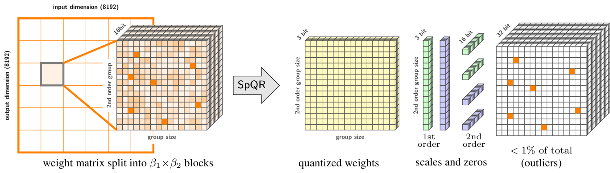

# SpQR: A Sparse‑Quantized Representation for Near‑Lossless LLM Weight Compression

## 0. Metadata
- **Full title**: SpQR: A Sparse‑Quantized Representation for Near‑Lossless LLM Weight Compression
- **Authors**: Tim Dettmers, Ruslan Svirschevski, Vage Egiazarian, Denis Kuznedelev, Elias Frantar, Saleh Ashkboos, Alexander Borzunov, Torsten Hoefler, Dan Alistarh
- **Venue / year**: ICLR 2024
- **Links**:
  - ArXiv: https://arxiv.org/abs/2306.03078
  - OpenReview: https://openreview.net/forum?id=Q1u25ahSuy
  - Code: https://github.com/Vahe1994/SpQR (mirrored under `context/refcode/SpQR/`)
- **Keywords**: LLMs, post‑training quantization, outliers, sparse‑quantized formats, GPTQ

## 1. TL;DR
- **Problem**: 3–4 bit PTQ gives big memory wins but hurts accuracy, especially for smaller deployable LLMs.
- **Idea**: Keep almost all weights in low‑bit grouped quantization, but store a tiny set of highly sensitive weights (“outliers”) in fp16 sparsely.
- **Result**: Near‑lossless perplexity (<1% gap vs fp16) at ~4.6–4.7 bits/parameter, plus 20–30% faster token generation on GPU.

> "Quantization down to 3-4 bits per parameter usually leads to moderate-to-high accuracy losses... To address this accuracy issue, we introduce... SpQR... [which] works by identifying and isolating outlier weights... and storing them in higher precision..." (paper-source/primary/tex/main.tex:126-132)  
> "SpQR... yields faster inference than 16-bit baselines... 20-30% faster for LLM generation..." (paper-source/primary/tex/main.tex:175-176)

## 2. Why do we need near‑lossless 3–4 bit quantization?
- **Edge/consumer deployment needs <4–5 bpp** (bits per parameter: average storage bits per weight, incl. metadata/outliers) to fit 7–65B LLMs on single GPUs / laptops / phones.
- **Generative setting is fragile**: small quantization errors can compound over autoregressive decoding.

> "By compressing such LLMs via quantization to 3-4 bits per parameter, they can fit into memory-limited devices..." (paper-source/primary/tex/main.tex:126-128)  
> "Since LLM generation is sequential... small relative errors can accumulate and lead to severely corrupted outputs." (paper-source/primary/tex/main.tex:150-151)

## 3. What have existing PTQ methods tried, and where do they fall short?

### 3.1 What if we just round weights (RTN)?
- **What it does**: direct round‑to‑nearest weights, often with groupwise scales.
- **Pitfall**: needs large groups to save metadata, but then errors from sensitive weights spread; accuracy drops remain large.

> "Early work... used direct rounding of weights to the nearest quantization level, while customizing the quantization granularity (i.e., group size) to trade off space for increased accuracy." (paper-source/primary/tex/main.tex:221-223)  
> "4-bit quantization is an optimal point for round-to-nearest-based methods..." (paper-source/primary/tex/main.tex:227-229)

### 3.2 Can Hessian‑aware GPTQ fix rounding error?
- **What GPTQ does (high‑level)**:
  - **One‑shot PTQ** using a small calibration set.
  - Builds a **Hessian proxy from activations** and uses it to guide rounding so layer outputs change as little as possible.
  - Quantizes a layer **column‑by‑column with error feedback**: after quantizing a column, it updates the remaining columns to compensate for induced error (greedy second‑order solve).

- **OBQ background**: GPTQ is the large‑model‑scalable version of **Optimal Brain Quantization (OBQ)**. OBQ applies the same second‑order idea weight‑by‑weight: it picks the quantized value that minimizes the quadratic loss increase and then updates remaining weights in closed form so they compensate (OBS‑style). OBQ is accurate but has cubic cost in input dimension, which is why GPTQ switches to block/column processing and Cholesky tricks.  
> "Our approach builds on ... OBQ ... quantizing one weight at a time while always updating all not‑yet‑quantized weights... OBQ's runtime ... cubic input dependency..." (paper-source/gptq/gptq.tex:153-178)

- **Where SpQR inherits GPTQ**:
  - SpQR’s conversion pipeline is explicitly an **extended GPTQ PTQ pass** per layer.  
  - The SpQR algorithm shows the GPTQ core: form \(H \approx 2XX^T\), invert/Cholesky, quantize columns, compute scaled error, and update the rest.  

> "We adopt an extended version of ... GPTQ... passes calibration data ... applies a layer‑wise solver w.r.t. L2 error..." (paper-source/primary/tex/main.tex:162-166)  
> "H := 2 X X^T ... H^{ic} := Cholesky((H+λI)^{-1}) ... Q_{:,j} := quantize(W_{:,j}) ... W := W - E · H^{ic}" (paper-source/primary/tex/method.tex:97-112)  
> "delta_weight_i ... quantization_errors[:, column_index] = delta_weight_i / H_inv_cho[...] " (context/refcode/SpQR/spqr_engine.py:204-214)

- **Why GPTQ alone is insufficient**:
  - Even with Hessian‑aware rounding, **all weights are still forced into the same low‑bit grid**, so a tiny set of high‑sensitivity weights dominates error.
  - To get good quality, GPTQ needs **very small groups**, which raises metadata cost; at typical 4‑bit budgets, **accuracy loss remains noticeable**, especially for 7–13B models.

> "GPTQ ... higher‑accuracy ... e.g., 4% LM Loss increase for LLaMA‑7B at 4‑bit." (paper-source/primary/tex/main.tex:223-225)  
> "Existing LLM quantization algorithms treat low‑ and high‑sensitivity weights equally..." (paper-source/primary/tex/method.tex:48-49)

### 3.3 Do activation outliers explain the problem (LLM.int8)?
- **What LLM.int8() does (high‑level)**:
  - Targets **8‑bit mixed‑precision inference**: most weights and activations are int8.
  - Detects a small set of **“outlier features”** in the *input/output activations* (feature dimensions with unusually large magnitude).
  - Keeps those activation dimensions (and their corresponding weight columns) in fp16 and adds their fp16 matmul contribution back to the int8 result.
  - Net effect: protects against **activation/input‑feature outliers**, not arbitrary weight outliers.

- **Why this doesn’t solve SpQR’s target**:
  - The outliers LLM.int8() handles live in activations/features; pushing weights down to **3–4 bits** still fails because there are additional **weight outliers** (rows, columns, scattered singles).  
  - SpQR’s analysis shows outliers tied to *output hidden dimensions* in the weights, beyond activation outliers.

> "LLM.int8() ... suggested isolating `outlier features` ... in the input/output of large LLMs..." (paper-source/primary/tex/main.tex:221-222, 237-241)  
> "Our work is the first to demonstrate that similar outliers occur in the weights, for particular output hidden dimensions." (paper-source/primary/tex/main.tex:173)

### 3.4 Will sparsity + quantization (SparseGPT) solve it?
- **What SparseGPT does (as framed in this paper)**:
  - **Post‑training sparsifies** LLM weights to a *medium* sparsity level.
  - **Quantizes the remaining non‑zero weights** to a fixed bit‑width.
  - Goal: trade dense parameters for zeros plus low‑bit codes.

> "SparseGPT ... jointly sparsify LLM weights to medium sparsities, together with quantization of the remaining weights..." (paper-source/primary/tex/main.tex:230)

- **Why this still falls short for near‑lossless 3–4 bpp**:
  - It does not explicitly **reserve higher precision for the few most sensitive weights**; remaining weights are still uniformly low‑bit.
  - The SpQR paper’s baseline takeaway is that **accuracy loss at low bit budgets remains significant** for small/medium LLaMA models under prior methods, motivating a different hybrid format.

> "One common drawback of existing methods is that the accuracy loss relative to the original model is still significant... especially ... 7-13B." (paper-source/primary/tex/main.tex:231-232)

## 4. What does weight sensitivity reveal?
- **What structures appear in sensitivity maps?**
  - **Row outliers**: a few output rows (hidden units) contain many high‑sensitivity weights, sometimes only for a subset of heads.  
  - **Column outliers**: a few input columns (feature dimensions) are sensitive across many rows; related to “outlier features” in activations.  
  - **Sensitive attention heads**: stripe‑like regions aligned with head boundaries (width 128) in Q/K/O projections.  
  - **Rotary‑embedding periodicity**: vertical sensitivity pattern with period 64 inside attention heads, tied to RoPE sine/cosine halves.  
  - **Unstructured singles**: isolated high‑sensitivity weights scattered across the matrix.

> "Row outliers... Column outliers... Sensitive attention heads... The Rotary embedding pattern... Unstructured outliers." (paper-source/primary/tex/method.tex:21-31)

- **How concentrated is the problem?**
  - A tiny minority of weights dominates quantization error; in some layers **~1% weights contribute >75% error**.

> "In some cases, 1% of the weights account for over 75% of the total quantization error." (paper-source/primary/tex/method.tex:61-63)

- **Why are these observations useful?**
  - **Local structure ⇒ use tiny groups**: if sensitivities change abruptly across small contiguous regions, large groups force sensitive and insensitive weights to share stats, worsening error.  
  - **Sparse high‑impact singles ⇒ isolate outliers**: leaving a few worst weights in fp16 gives a large error drop per extra bit.  
  - **Mixed structure ⇒ need a flexible hybrid format**: neither “only column outliers” nor “only row outliers” is enough; a CSR‑style sparse residual can encode all patterns.

> "Weights behave similarly in small consecutive groups... use groupwise quantization with extremely small groups..." (paper-source/primary/tex/method.tex:53-54)  
> "We choose to keep these outliers in high precision (16-bit)... encode them individually in a row-wise arrangement similar to CSR." (paper-source/primary/tex/method.tex:61-65)

  
> "Weight log-sensitivities from the last attention layer of LLaMA-65B. Dark-blue shades indicate higher sensitivity. The image on the left is a high-level view, resized to 1:32 scale with max-pooling. The two images in the middle are zoomed in from the main figure. The two images on the right are taken from other weight matrices." (paper-source/primary/tex/method.tex:3-11)

## 5. How should we allocate bits to sensitive weights? (SpQR)

### 5.1 What hybrid representation could isolate the hard weights?
  
> "A high-level overview of the SpQR representation for a single weight tensor... stored data types and their dimensions." (paper-source/primary/tex/method.tex:196-205)
> "For each outlier, we store two scalars: the 16-bit weight value and the 16-bit column index. For each row, we also store a single 32-bit number..." (paper-source/primary/tex/method.tex:218-222)

- **Storage idea / format (per layer)**:
  - Decompose each weight matrix \(W\) into a **dense low‑bit base \(Q\)** plus a **sparse fp16 residual \(W_{\text{sparse}}\)** at outlier positions:  
    \(W \approx \text{dequant}(Q,\ \text{stats}) + W_{\text{sparse}}\).
  - Store three aligned components:
    1. **Base weights \(Q\)**: non‑outliers quantized to `b_w`=3–4 bits with tiny groups along input columns.  
    2. **Bilevel metadata**: 1st‑order per‑group scales/zeros, and 2nd‑order stats that quantize those scales/zeros.  
    3. **Outlier residual**: fp16 outlier values plus indices in a CSR‑like layout (values + column ids + row pointers).
  - Intuition: most weights pay only low‑bit cost, while a small “escape hatch” of fp16 outliers repairs the dominant error.

> "SpQR works by identifying and isolating outlier weights... while compressing all other weights to 3-4 bits..." (paper-source/primary/tex/main.tex:129-130)  
> "We implement... very small group size... and quantize the quantization scales themselves to a 3-bit representation." (paper-source/primary/tex/main.tex:158-160)  
> "Representation consists of (1) quantized weights, (2) first/second‑level quantization statistics, and (3) the CSR outlier indices and values." (paper-source/primary/tex/method.tex:196-197)

- **Why this meets a tight bit budget**:
  - Average bits per parameter are the base weight bits plus amortized metadata plus the outlier overhead:
    \[
      \overline{b} \simeq b_w + \frac{b_s+b_z}{\beta_1} + \frac{64}{\beta_1\beta_2} + 32\,r_o .
    \]
  - With \(b_w\in\{3,4\}\), very small \(\beta_1,\beta_2\), and \(r_o<1\%\), this lands around 3.6–4.7 bpp while staying accurate.

> "\(\overline{b} \simeq b_w + \frac{b_s+b_z}{\beta_1} + \frac{64}{\beta_1\beta_2} + 32r_o\)" (paper-source/primary/tex/appendix.tex:179-187)

### 5.2 Which weights should be left as fp16 outliers?
- **GPTQ lens for “sensitivity”**:
  - GPTQ models the effect of quantizing a layer as a **quadratic loss** weighted by a Hessian proxy from calibration activations.
  - So a weight/column is “sensitive” if forcing it onto a low‑bit grid would **increase GPTQ’s quadratic error a lot**, not just raw weight MSE.

> "We adopt an extended version of ... GPTQ ... applies a layer-wise solver with respect to the L2 error between the outputs..." (paper-source/primary/tex/main.tex:162-166)

  **GPTQ quadratic score (key equations)**:

  GPTQ minimizes the layer reconstruction loss

  $$
  L(\widehat W)=\|WX-\widehat W X\|_F^2 .
  $$

  **Symbols**:
  - \(\|\cdot\|_F\): Frobenius norm (sum of squared matrix entries).
  - \(W\): original fp16 weight matrix of this linear layer.
  - \(\widehat W\): quantized version of \(W\).
  - \(X\): calibration activations at the layer input (columns are samples).
  - \(H\): Hessian proxy of \(L\) in input/column space.
  - \(\lambda\): damping / regularizer, \(I\) identity.
  - \(w_q\): scalar weight (or a column) indexed by \(q\); \(\mathrm{quant}(\cdot)\) rounds to the low‑bit grid.

  The quadratic (second‑order) form of \(L\) gives

  $$
  H \equiv \nabla_{\widehat W}^2 L \;\approx\; 2XX^\top,\qquad
  H^{-1}=(2XX^\top+\lambda I)^{-1}.
  $$

  Greedily quantizing coordinate/column \(q\) yields the minimal quadratic loss increase

  $$
  \Delta L^*(w_q)=\tfrac12\,\frac{(\mathrm{quant}(w_q)-w_q)^2}{[H^{-1}]_{qq}}.
  $$

  **Sensitivity link**: in the quadratic approximation, a weight perturbation \(\delta W\) changes the loss by
  \(\Delta L \approx \tfrac12\,\mathrm{tr}(\delta W\,H\,\delta W^\top)\). For a single coordinate \(\delta w_q\), OBQ’s optimal adjustment of the remaining weights yields the closed form above, so the effective curvature along \(q\) is \(1/[H^{-1}]_{qq}\).  
  Small \([H^{-1}]_{qq}\) ⇒ large effective curvature ⇒ even tiny quantization errors hurt a lot and are hard to compensate ⇒ high‑sensitivity / likely outlier.

  **Practicality**: under this L2 reconstruction objective, \(L\) decomposes over output rows, so the full Hessian w.r.t. \(\mathrm{vec}(W)\) is block‑diagonal \(I_{d_{\text{out}}}\otimes H\). This lets GPTQ/SpQR compute the small \(d_{\text{in}}\!\times\! d_{\text{in}}\) matrix \(H\) once per layer and apply the greedy score efficiently.

- **Leave‑one‑out outlier score**:
  - For each tiny \(\beta_1\)-column group, compute the GPTQ‑style Hessian‑weighted error when *all* columns are quantized.
  - Then ask: **how much would that error drop if column \(k\) stayed fp16?**
  - If the drop exceeds \(\tau\), mark column \(k\)’s weights as outliers.  
  - Outliers can be intrinsically sensitive **or** act as GPTQ “compensation knobs” for other columns.

> "E_base = error(W, H^{ic}) ... E_ol = error(W_{:,loo}, H^{ic}_{loo,loo}) ... select(E_base − E_ol > τ)" (paper-source/primary/tex/method.tex:141-156)  
> "A weight can be chosen to be an outlier... if the GPTQ algorithm can employ this weight to compensate errors from many other weights." (paper-source/primary/tex/method.tex:79)

- **Budget / choosing \(\tau\)**:
  - \(\tau\) directly controls the outlier rate \(r_o\): larger \(\tau\) ⇒ fewer outliers.
  - For each configuration, they **binary‑search \(\tau\)** (typically in \([0.1,1.0]\)) to hit a small target outlier budget; most runs land around \(\tau\in[0.1,0.45]\).
  - In experiments they enforce **\(r_o < 1\%\)** overall (often 0.2–0.5%) so the sparse fp16 residual stays within the bit budget.

> "We choose τ such that the proportion of outliers is under 1%." (paper-source/primary/tex/experiments.tex:23-25)  
> "We tune τ in [0.1, 1.0] range by binary search... vast majority between τ=0.1 and τ=0.45." (paper-source/primary/tex/appendix.tex:100)  
> "Optimal fraction of outliers is 0.2-0.5% depending on the model and groupsize." (paper-source/primary/tex/appendix.tex:206-209)

- **Reference code (grounding)**:  
> "loo_quantization_error_sq = get_leave_one_out_error(...)" (context/refcode/SpQR/spqr_engine.py:153-156)  
> "reduction_in_squared_error = baseline_errors_sq - loo_errors_sq" (context/refcode/SpQR/spqr_engine.py:324-335)

- **Pseudo code (high‑level)**:

```python
def detect_outliers_in_group(Wg, H_ic_g, bits, tau):
    # GPTQ-style Hessian‑weighted error if we quantize whole group
    base_err = gptq_quadratic_error(quantize(Wg, bits), H_ic_g)
    outliers = zeros_like(Wg, dtype=bool)
    for k in range(Wg.shape[1]):
        # leave column k in fp16, quantize the rest
        loo_err = gptq_quadratic_error(quantize(Wg[:, except(k)], bits), H_ic_g[except(k), except(k)])
        if base_err - loo_err > tau:
            outliers[:, k] = True
    return outliers
```

### 5.3 How can tiny groups be affordable? (Bilevel stats)
- **First‑order groups (β₁)**: extremely small groups of consecutive weights share one scale/zero.  
> "groupwise quantization with extremely small groups, typically of β₁=8-32 weights... separate quantization scale and zero-point." (paper-source/primary/tex/method.tex:53-55)

- **Second‑order groups (β₂)**: quantize the *scales/zeros* themselves in blocks of β₂ consecutive entries to reduce metadata cost.  
> "We group groupwise statistics from β₂=16 consecutive values and quantize them together..." (paper-source/primary/tex/method.tex:58-59)  
> "fit_statistics... fit_quantizer(s, β₂)... quantize(s, s_s, s_z)" (paper-source/primary/tex/method.tex:172-175)

- **Implementation geometry (important for mental model)**:
  - **Weights** are grouped as full‑height vertical strips of width `groupsize` along the input/column axis.  
    > "group_weight = weight[:, column_index : column_index + groupsize]" (context/refcode/SpQR/spqr_engine.py:141-145)
  - **Stats** are grouped by reshaping consecutive scale/zero entries into `qq_groupsize` blocks.  
    > "scale_groups = self.scale.reshape(-1, self.qq_groupsize)... zero_groups = self.zero.reshape(-1, self.qq_groupsize)" (context/refcode/SpQR/quant_groups.py:103-114)
  - In the optimized kernel these correspond to tiles of **β₂ output rows × β₁ input columns** (paper notation).  
    > The released kernels/export store `beta2 = groupsize` (first‑order column groups, β₁) and `beta1 = qq_groupsize` (second‑order stats groups, β₂), i.e., `beta1/beta2` are swapped relative to the paper’s names. (context/refcode/SpQR/convert_to_hf.py:76-79; context/refcode/SpQR/README.md:90-91)

### 5.4 How do we compute with sparse outliers efficiently?
- **Dense + sparse decomposition**:  
  - Dense low‑bit matmul over base weights.  
  - Sparse matmul over outliers; sum results.
- **Custom sparse algorithm** uses CSR ordering and GPU shared memory for load‑balanced, mostly contiguous access.

> "combine this sparse algorithm together with a dense-quantized matrix multiplication for 3-4 bit weights." (paper-source/primary/tex/main.tex:175-176)  
> "divide the matrix into blocks... load outliers into shared memory... determine if outliers are part of the segment... load weights... perform matmul." (paper-source/primary/tex/method.tex:229-237)

  
> "SpQR quantization algorithm: ... full procedure ... bilevel quantization and finding outliers." (paper-source/primary/tex/method.tex:83-85)

## 6. Does this actually work in practice?

### 6.1 Can we match fp16 perplexity under 5 bpp? (LLaMA)
- Two SpQR configurations per model size:
  - **Near‑lossless (~4.6–4.7 bpp)**: higher budget, ≤1% perplexity gap vs fp16.
  - **Size‑matched (~3.9–4.0 bpp)**: tuned to ~4 bpp for fair comparison to RTN‑4bit / GPTQ‑4bit.

  **Key slice (LLaMA‑7B)**:

  | Method | Avg bits | Wiki2 | C4 | PTB |
  | --- | ---: | ---: | ---: | ---: |
  | fp16 baseline | 16.00 | 5.68 | 7.08 | 8.80 |
  | RTN‑4bit | 4.00 | 6.43 | 7.93 | 10.30 |
  | GPTQ‑4bit | 4.00 | 6.13 | 7.43 | 9.27 |
  | SpQR (~4 bpp) | 3.94 | 5.87 | 7.28 | 9.07 |
  | SpQR (near‑lossless) | 4.63 | 5.73 | 7.13 | 8.88 |

> Table 1 shows both SpQR rows per size and their Avg bits (paper-source/primary/tex/experiments.tex:61-65,67-71,80-90).

### 6.2 Is SpQR faster than fp16 at runtime?
- Optimized SpQR kernel beats fp16 and is ~2× faster than dense‑quant + PyTorch sparse baseline.

  **Key slice (tokens/s)**:
  - **13B scratch**: fp16 `37±0.8` → SpQR optimized `44±0.5`; SpQR(PyTorch) `24±1.2`.  
  - **30B scratch**: fp16 `19±1.1` → SpQR optimized `22±0.9`; SpQR(PyTorch) `8.8±0.4`.  
  - **13B prefix‑1024**: fp16 `31±0.9` → SpQR optimized `37±0.8`.  
  - **30B prefix‑1024**: fp16 `17±0.8` → SpQR optimized `22±1.3`.  

  **Inference speed table (tokens/s, A100, batch=1)**:

  | Setup / Method | 7B | 13B | 30B | 65B |
  | --- | ---: | ---: | ---: | ---: |
  | fp16 scratch | 47±2.3 | 37±0.8 | 19±1.1 | OOM |
  | SpQR (PyTorch) scratch | 30±2.2 | 24±1.2 | 8.8±0.4 | OOM |
  | SpQR (optimized) scratch | **57±2.4** | **44±0.5** | **22±0.9** | **12±0.6** |
  | fp16 prefix‑1024 | 46±2.4 | 31±0.9 | 17±0.8 | OOM |
  | SpQR (PyTorch) prefix‑1024 | 27±1.6 | 21±1.1 | 6.5±0.7 | OOM |
  | SpQR (optimized) prefix‑1024 | **55±2.1** | **37±0.8** | **22±1.3** | **11±0.6** |

  (From Table `tab:inference` in `paper-source/primary/tex/experiments.tex:208-221`; OOM = model does not fit on a single A100.)

> "Inference speed comparison (tokens/s)... optimized SpQR... faster than the 16-bit baseline and almost 2.0x faster than ... PyTorch sparse..." (paper-source/primary/tex/experiments.tex:204-221)

### 6.3 Which components matter most?
- **Bilevel stats + small groups** materially improve loss at the same ~3.6 bpp.  
> "3-bit SpQR with group size 16... using 3-bit bilevel quantization vs ... 16-bit statistics... quantized statistics significantly improves language modeling loss." (paper-source/primary/tex/experiments.tex:148-150)

  **Ablation table (LLaMA‑65B, no outliers)**:

  | Config | Avg bits | Wiki2 | C4 | PTB | Implies |
  | --- | ---: | ---: | ---: | ---: | --- |
  | fp16 baseline | 16.00 | 3.53 | 5.62 | 6.91 | Reference (no quantization). |
  | GPTQ‑4bit | 4.00 | 3.83 | 5.80 | 7.07 | Hessian‑aware PTQ baseline; still noticeable loss. |
  | SpQR w/ **3‑bit bilevel stats** | 3.63 | 3.74 | 5.73 | 7.02 | Quantized stats enable tiny groups at same bpp. |
  | SpQR w/ 16‑bit stats (larger groups) | 3.67 | 3.84 | 5.83 | 7.12 | Without bilevel stats, accuracy drops at same bpp. |
  | SpQR “round zero” | 3.63 | 3.75 | 5.76 | 7.01 | Zero‑point rounding slightly hurts; bit‑saving tweak. |
  | SpQR w/o act‑order | 3.63 | 3.74 | 5.76 | 7.05 | Act‑order gives only a minor gain. |

  (From Table `Tab:ablation` in `paper-source/primary/tex/experiments.tex:157-178`.)

  **Interpretation**: The two middle rows isolate bilevel statistics. At essentially the same bpp (~3.6), quantizing scales/zeros to 3 bits lets SpQR use much smaller first‑order groups, reducing perplexity by ~0.1 across datasets versus keeping 16‑bit stats. The last two rows show that “round zero” and activation‑order are second‑order tweaks: they move perplexity only marginally compared to the gain from bilevel stats (and, in the full method, outliers).

- **Unstructured outliers are most efficient per bit** vs row/column outliers.  
> "Overall, unstructured outliers reduce perplexity significantly faster..." (paper-source/primary/tex/experiments.tex:152-153)

- **Minor heuristics**: rounding zero‑points and act‑order have smaller effects.  
> "'Round zero'... reduces footprint but increases perplexity... act order... slightly improves loss..." (paper-source/primary/tex/experiments.tex:155)

## 7. What did we learn, and what’s next?
- **Takeaway**: A tiny fp16 sparse residual + aggressively compressed metadata unlocks near‑lossless 3–4 bit PTQ for LLMs.

> "SpQR... achieve near-lossless 16-bit accuracy with less than 4.75 bits per parameter on average." (paper-source/primary/tex/main.tex:342)

- **Future directions**:
  - Reduce outlier overhead by grouping/compressing them further.  
    > "This could be reduced significantly by grouping outliers, which we leave as future work." (paper-source/primary/tex/method.tex:222-223)
  - Evaluate human‑judged generation quality and fuse dense+sparse kernels more tightly.  
    > "We do not evaluate the generative quality... another limitation is that we do not fuse sparse matrix multiplication with regular quantized matrix multiplication... leave... to future work." (paper-source/primary/tex/main.tex:343-344)
